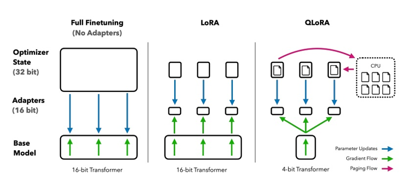

# Week 3: Efficient Fine-Tuning with Modern PEFT Techniques

## 1. The Need for Parameter-Efficient Fine-Tuning (PEFT)

The emergence of large language models (LLMs) has necessitated a **new paradigm for fine-tuning**. Fully fine-tuning models like GPT-3, BERT, or LLaMA with billions of parameters presents fundamental challenges:

- **Memory Explosion**: A 7B parameter model alone requires ~28GB GPU memory, with actual requirements exceeding 40GB when considering gradients and optimizer states
- **Computational Cost**: Updating billions of parameters consumes **enormous computational resources** and time
- **Overfitting Risk**: Limited training data can lead to **catastrophic forgetting** of pre-trained knowledge
- **Storage Overhead**: Storing entire models for each task becomes **impractical for deployment and management**

**Parameter-Efficient Fine-Tuning (PEFT)** solves these problems by training only a **small portion of the model**. The core insight is that **"weight updates lie in a low-dimensional subspace"**. Instead of exploring the entire parameter space, we find **effective update directions**.

### Core Benefits of PEFT

- **Memory Efficiency**: Train **65B parameter models** on a single 48GB GPU
- **Fast Convergence**: Achieve **10x faster training** with fewer parameters
- **Better Generalization**: Constrained updates prevent **overfitting** and ensure stable performance
- **Modularity**: **Small adapters** can be easily stored, shared, and swapped
- **Inference Efficiency**: Merge adapters into base weights to **eliminate overhead**

This lecture explores **cutting-edge PEFT techniques**: **LoRA**, **DoRA**, **WaveFT**, **VB-LoRA**, **QR-Adaptor**, and **QLoRA**. These methods **redefine efficiency boundaries**, enabling researchers and practitioners to achieve **maximum performance with minimal resources**.

## 2. LoRA: The Foundation of Low-Rank Adaptation

**LoRA (Low-Rank Adaptation)** has become the **foundation and standard** of PEFT techniques. Proposed by Microsoft in 2021, LoRA is based on the key insight that **"weight updates lie in a low-dimensional subspace"**, achieving efficiency through **low-rank matrix decomposition** instead of updating all parameters.

### 2.1 Core Principles of LoRA

Instead of directly updating the full weight matrix $W_0 \in \mathbb{R}^{d \times k}$, LoRA decomposes the update through **low-rank factorization**:

$$\Delta W = A \times B$$

where:

- $A \in \mathbb{R}^{d \times r}$ and $B \in \mathbb{R}^{r \times k}$ are **low-rank matrices**
- $r \ll \min(d, k)$ is the **rank** (typically 4, 8, 16)
- Only $A$ and $B$ are **trainable parameters**

The final weight becomes: $W = W_0 + \Delta W = W_0 + AB$

### 2.2 Mathematical Example of LoRA

For a **768×768 attention weight matrix** with rank $r=8$:

- **Full fine-tuning**: 768² = **589,824 parameters**
- **LoRA**: 8×(768+768) = **12,288 parameters** (98% reduction!)

This **dramatic parameter reduction** reduces memory usage by 90%+ while **minimizing performance loss**.

### 2.3 LoRA Implementation Example

```python
import torch
import torch.nn as nn
from peft import LoraConfig, get_peft_model

# Apply LoRA to Korean BERT model
model_name = "klue/bert-base"
model = AutoModelForSequenceClassification.from_pretrained(
    model_name,
    num_labels=2,
    torch_dtype=torch.float16
)

# LoRA configuration
lora_config = LoraConfig(
    task_type=TaskType.SEQ_CLS,
    r=8,                    # LoRA rank
    lora_alpha=32,          # Scaling factor
    target_modules=["query", "value", "key", "dense"],  # Target layers
    lora_dropout=0.1,
    bias="none"
)

# Apply LoRA to model
model = get_peft_model(model, lora_config)
print(f"Trainable parameters: {model.print_trainable_parameters()}")
```

**Example Output:**

```
trainable params: 1,572,864 || all params: 110,104,322 || trainable%: 1.43
```

### 2.4 Key Advantages and Limitations of LoRA

**Advantages:**

- **Parameter Efficiency**: Uses only 0.1%-0.5% of original parameters
- **Memory Savings**: 90%+ reduction in memory usage
- **No Inference Overhead**: Adapters can be merged into base weights
- **Modularity**: Task-specific adapters can be easily swapped

**Limitations:**

- **Low-rank Bottleneck**: Rank constraints may limit expressiveness
- **Hyperparameter Sensitivity**: Performance varies with rank and alpha values
- **Lack of Layer-wise Optimization**: Same settings applied to all layers

### Checkpoint Questions

- Why does LoRA constrain weight updates to a low-dimensional subspace?
- Calculate the parameter reduction rate for a 1024×1024 weight matrix with rank $r=16$
- In what situations does LoRA's "low-rank bottleneck" problem become more severe?

## 3. DoRA: High-Performance Adaptation through Weight Decomposition

**DoRA (Weight-Decomposed Low-Rank Adaptation)** is an innovative PEFT technique proposed by NVIDIA in 2024 that addresses LoRA's **low-rank bottleneck problem** by **explicitly separating magnitude and direction** of weight updates. This approach provides greater flexibility and often achieves **3.7% superior performance** compared to standard LoRA.

### 3.1 Core Idea of DoRA

DoRA decomposes each weight matrix $W_0$ into **two independent components**:

1. **Direction**: $V = \frac{W_0}{||W_0||_F}$ (Frobenius norm normalization)
2. **Magnitude**: $m = ||W_0||_F$ (scalar magnitude)

The key insight is that these components can be **updated independently** during fine-tuning.

### 3.2 Mathematical Formulation of DoRA

For a weight matrix $W_0 \in \mathbb{R}^{d \times k}$:

1. **Decomposition**:

   - $V = \frac{W_0}{||W_0||_F}$ (direction vector)
   - $m = ||W_0||_F$ (magnitude scalar)

2. **Direction Update**: Apply LoRA to the direction

   - $\Delta V = AB$ where $A \in \mathbb{R}^{d \times r}$, $B \in \mathbb{R}^{r \times k}$
   - $V' = V + \Delta V$

3. **Magnitude Update**: Learn a scaling factor

   - $m' = m + \Delta m$ where $\Delta m$ is a learnable scalar

4. **Reconstruction**: $W' = m' \times \frac{V'}{||V'||_F}$


_DoRA Structure: The pre-trained weight $W_0$ is factored into a frozen direction $V$ and a learnable magnitude $m$. DoRA applies a LoRA-style low-rank update to adjust the direction and also tunes the magnitude $m$. After training, the magnitude and new direction are multiplied to form the merged weight $W'$._

### 3.3 Key Advantages of DoRA

- **Decoupled Updates**: Magnitude and direction can **change independently**
- **Better Expressiveness**: Captures both **scaling and directional changes**
- **Minimal Overhead**: Adds only **a few magnitude parameters per layer**
- **Drop-in Replacement**: Can be used **wherever LoRA is applied**

### 3.4 DoRA Performance Results

DoRA consistently outperforms LoRA across various benchmarks:

- **LLaMA-7B**: **3.7% average improvement** on commonsense reasoning tasks
- **Parameter Efficiency**: Achieves better results with **25% fewer trainable parameters**
- **Low-Rank Settings**: Particularly effective when **LoRA rank is constrained**
- **Training Dynamics**: Weight update patterns **more closely resemble full fine-tuning**

### 3.5 DoRA Implementation Example

```python
import torch
import torch.nn as nn

class DoRALayer(nn.Module):
    def __init__(self, base_layer, rank=8, alpha=32):
        super().__init__()
        self.base_layer = base_layer
        self.rank = rank
        self.alpha = alpha

        # LoRA matrices
        self.lora_A = nn.Linear(base_layer.in_features, rank, bias=False)
        self.lora_B = nn.Linear(rank, base_layer.out_features, bias=False)

        # Magnitude parameter
        self.magnitude = nn.Parameter(torch.ones(base_layer.out_features))

        # Initialize
        nn.init.kaiming_uniform_(self.lora_A.weight)
        nn.init.zeros_(self.lora_B.weight)

    def forward(self, x):
        # Base output
        base_output = self.base_layer(x)

        # LoRA update
        lora_output = self.lora_B(self.lora_A(x)) * (self.alpha / self.rank)

        # Apply magnitude scaling
        scaled_output = (base_output + lora_output) * self.magnitude

        return scaled_output
```

### Checkpoint Questions

- How does DoRA's weight decomposition differ from LoRA's low-rank approximation?
- Why might separating magnitude and direction updates lead to better performance?
- Why is DoRA particularly effective in low-rank settings?

## 4. QLoRA: Combining 4-bit Quantization with LoRA

**QLoRA (Quantized LoRA)** represents a **breakthrough** in efficient fine-tuning, enabling the training of **65B parameter models on a single 48GB GPU**. The key innovation lies in **combining 4-bit quantization with LoRA adapters** while maintaining performance.

### 4.1 Core Concept of QLoRA

QLoRA follows a **three-step approach**:

1. **Quantize**: Pre-trained model weights to **4-bit precision**
2. **Freeze**: Quantized weights (no gradient updates)
3. **Train**: LoRA adapters at **16-bit precision** with full backpropagation through quantized weights

This combination **reduces memory usage by ~75%** while preserving model performance.

### 4.2 NF4 Quantization: The Key Innovation

The success of QLoRA hinges on **NF4 (NormalFloat-4)**, a custom 4-bit data type optimized for neural network weights:

- **Information-Theoretically Optimal**: NF4 uses a **logarithmic distribution** that matches the normal distribution of neural weights
- **Superior Performance**: Achieves **27.4 vs 31.1 perplexity** compared to standard 4-bit quantization
- **Efficient Representation**: Uses all **16 possible 4-bit values** optimally across the weight distribution

### 4.3 QLoRA Technical Innovations

**Double Quantization:**

- Quantizes both model weights (4-bit) and scaling factors (8-bit)
- Further reduces **memory overhead without performance loss**
- Implemented efficiently in the bitsandbytes library

**Paged Optimizers:**

- Swaps gradients and momentum to **CPU memory during peaks**
- Prevents **out-of-memory errors** on large models
- Enables training of models that wouldn't fit otherwise

### 4.4 QLoRA Performance Results

QLoRA achieves remarkable results:

- **Memory Efficiency**: **75% reduction in memory usage**
- **Performance Parity**: Matches **full 16-bit fine-tuning** on GLUE and instruction-following tasks
- **Scalability**: Enables fine-tuning of **30B-65B models on single GPUs**
- **Speed**: **4-bit operations are often faster** than 16-bit on modern hardware


_Comparison of full fine-tuning vs LoRA vs QLoRA. QLoRA does the same low-rank adaptation but on a 4-bit quantized base model; gradients flow through the 4-bit model to the LoRA adapters. This approach cuts memory by ~75% while preserving performance._

### 4.5 QLoRA Implementation Example

```python
from transformers import BitsAndBytesConfig, AutoModelForCausalLM
from peft import LoraConfig, get_peft_model

# Configure 4-bit quantization
quantization_config = BitsAndBytesConfig(
    load_in_4bit=True,
    bnb_4bit_quant_type="nf4",
    bnb_4bit_compute_dtype=torch.float16,
    bnb_4bit_use_double_quant=True
)

# Load model with quantization
model = AutoModelForCausalLM.from_pretrained(
    "beomi/KoAlpaca-7B",
    quantization_config=quantization_config,
    device_map="auto",
    torch_dtype=torch.float16
)

# Configure LoRA for QLoRA
lora_config = LoraConfig(
    r=16,
    lora_alpha=32,
    target_modules=["q_proj", "v_proj", "k_proj", "o_proj", "gate_proj", "up_proj", "down_proj"],
    lora_dropout=0.1,
    bias="none",
    task_type="CAUSAL_LM"
)

# Apply LoRA
model = get_peft_model(model, lora_config)
```

### Checkpoint Questions

- How does NF4 quantization differ from standard 4-bit quantization approaches?
- What are the key technical innovations that make QLoRA work effectively?
- When would you choose QLoRA over standard LoRA or full fine-tuning?

## 5. PEFT Method Comparison and Selection Guide

Now let's compare the **LoRA, DoRA, QLoRA** and other PEFT techniques we've explored in terms of **performance, memory efficiency, and use cases**.

### 5.1 PEFT Method Performance Comparison

| Method      | Parameter Efficiency | Performance      | Memory Savings | Use Case                  |
| ----------- | -------------------- | ---------------- | -------------- | ------------------------- |
| **LoRA**    | 0.1-0.5% of model    | Baseline         | 90%            | General purpose           |
| **DoRA**    | 0.1-0.5% of model    | +3.7% over LoRA  | 90%            | Better performance needed |
| **QLoRA**   | 75% memory reduction | Matches full FT  | 75%            | Large models              |
| **VB-LoRA** | 0.01% of LoRA        | Better than LoRA | 99%            | Multi-task scenarios      |

### 5.2 Situational PEFT Method Selection Guide

**For Research and Experimentation:**

- **Baseline Performance**: Start with LoRA
- **Better Results**: Use DoRA
- **Large Models**: Consider QLoRA

**For Production Deployment:**

- **Large Models (7B+ parameters)**: Use QLoRA
- **Memory-Constrained Environment**: QLoRA + DoRA combination
- **Multi-Task Scenarios**: Use VB-LoRA

**For Resource-Limited Environments:**

- **Minimal Parameter Budget**: VB-LoRA
- **Memory Constraints**: QLoRA
- **Storage Limitations**: VB-LoRA

### 5.3 PEFT Method Comparison Experiment

```python
import time
import psutil
import torch
from typing import Dict, Any

class PEFTComparison:
    def __init__(self, model_name: str, dataset):
        self.model_name = model_name
        self.dataset = dataset
        self.results = {}

    def evaluate_method(self, method_name: str, config: Dict[str, Any]):
        """Evaluate a PEFT method and record metrics"""

        # Load model
        model = AutoModelForSequenceClassification.from_pretrained(
            self.model_name, num_labels=2
        )

        # Apply PEFT method
        if method_name == "LoRA":
            peft_config = LoraConfig(**config)
            model = get_peft_model(model, peft_config)
        elif method_name == "DoRA":
            model = apply_dora_to_model(model, **config)
        # Add other methods...

        # Record metrics
        start_time = time.time()
        start_memory = psutil.Process().memory_info().rss / 1024 / 1024  # MB

        # Training (simplified)
        trainer = Trainer(
            model=model,
            train_dataset=self.dataset,
            args=TrainingArguments(
                output_dir=f"./results/{method_name}",
                num_train_epochs=1,
                per_device_train_batch_size=8,
                logging_steps=10,
            )
        )

        trainer.train()

        end_time = time.time()
        end_memory = psutil.Process().memory_info().rss / 1024 / 1024  # MB

        # Record results
        self.results[method_name] = {
            "trainable_params": sum(p.numel() for p in model.parameters() if p.requires_grad),
            "total_params": sum(p.numel() for p in model.parameters()),
            "training_time": end_time - start_time,
            "memory_usage": end_memory - start_memory,
            "config": config
        }

        return self.results[method_name]

    def compare_methods(self):
        """Compare all methods and print results"""
        print("PEFT Methods Comparison")
        print("=" * 50)

        for method, results in self.results.items():
            print(f"\n{method}:")
            print(f"  Trainable Parameters: {results['trainable_params']:,}")
            print(f"  Parameter Ratio: {results['trainable_params']/results['total_params']:.4f}")
            print(f"  Training Time: {results['training_time']:.2f}s")
            print(f"  Memory Usage: {results['memory_usage']:.2f}MB")
```

### Checkpoint Questions

- How would you choose between LoRA and DoRA for a specific task?
- What are the key considerations when implementing QLoRA?
- How would you design an experiment to compare PEFT methods fairly?

## 6. Hands-on: PEFT Method Comparison Experiment

Now that we understand the theoretical foundations, let's **implement and compare PEFT techniques in practice**. We'll conduct a hands-on experiment comparing **LoRA, DoRA, and QLoRA** performance on Korean sentiment analysis.

### 6.1 Experiment Environment Setup

```bash
# Install required libraries
pip install torch transformers datasets peft accelerate bitsandbytes
pip install numpy pandas scikit-learn
```

### 6.2 Korean Sentiment Analysis Dataset Preparation

```python
from datasets import load_dataset
from transformers import AutoTokenizer
import torch

# Load NSMC (Naver Sentiment Movie Corpus) dataset
dataset = load_dataset("nsmc")
tokenizer = AutoTokenizer.from_pretrained("klue/bert-base")

# Data preprocessing function
def preprocess_function(examples):
    return tokenizer(
        examples["document"],
        truncation=True,
        padding=True,
        max_length=128
    )

# Preprocess dataset
train_dataset = dataset["train"].map(preprocess_function, batched=True)
test_dataset = dataset["test"].map(preprocess_function, batched=True)

print(f"Training data: {len(train_dataset)} samples")
print(f"Test data: {len(test_dataset)} samples")
```

### 6.3 LoRA Implementation and Training

```python
from transformers import AutoModelForSequenceClassification, TrainingArguments, Trainer
from peft import LoraConfig, get_peft_model, TaskType
import time

def train_lora_model():
    # Load model
    model = AutoModelForSequenceClassification.from_pretrained(
        "klue/bert-base",
        num_labels=2,
        torch_dtype=torch.float16
    )

    # LoRA configuration
    lora_config = LoraConfig(
        task_type=TaskType.SEQ_CLS,
        r=8,
        lora_alpha=32,
        target_modules=["query", "value", "key", "dense"],
        lora_dropout=0.1,
        bias="none"
    )

    # Apply LoRA to model
    model = get_peft_model(model, lora_config)
    print(f"LoRA trainable parameters: {model.print_trainable_parameters()}")

    # Training setup
    training_args = TrainingArguments(
        output_dir="./lora_results",
        num_train_epochs=3,
        per_device_train_batch_size=16,
        learning_rate=2e-4,
        logging_steps=100,
        save_steps=500,
        evaluation_strategy="steps",
        eval_steps=500,
        load_best_model_at_end=True,
    )

    # Start training
    start_time = time.time()
    trainer = Trainer(
        model=model,
        args=training_args,
        train_dataset=train_dataset.select(range(1000)),  # Use 1000 samples for quick experiment
        eval_dataset=test_dataset.select(range(200)),
        tokenizer=tokenizer,
    )

    trainer.train()
    training_time = time.time() - start_time

    # Evaluation
    eval_results = trainer.evaluate()

    return {
        "method": "LoRA",
        "accuracy": eval_results["eval_accuracy"],
        "training_time": training_time,
        "trainable_params": sum(p.numel() for p in model.parameters() if p.requires_grad)
    }

# Execute LoRA training
lora_results = train_lora_model()
print(f"LoRA results: {lora_results}")
```

### 6.4 QLoRA Implementation and Training

```python
from transformers import BitsAndBytesConfig

def train_qlora_model():
    # Configure 4-bit quantization
    quantization_config = BitsAndBytesConfig(
        load_in_4bit=True,
        bnb_4bit_quant_type="nf4",
        bnb_4bit_compute_dtype=torch.float16,
        bnb_4bit_use_double_quant=True,
    )

    # Load model with quantization
    model = AutoModelForSequenceClassification.from_pretrained(
        "klue/bert-base",
        num_labels=2,
        quantization_config=quantization_config,
        torch_dtype=torch.float16
    )

    # Configure LoRA for QLoRA
    lora_config = LoraConfig(
        task_type=TaskType.SEQ_CLS,
        r=8,
        lora_alpha=32,
        target_modules=["query", "value", "key", "dense"],
        lora_dropout=0.1,
        bias="none"
    )

    # Apply LoRA
    model = get_peft_model(model, lora_config)
    print(f"QLoRA trainable parameters: {model.print_trainable_parameters()}")

    # Training setup
    training_args = TrainingArguments(
        output_dir="./qlora_results",
        num_train_epochs=3,
        per_device_train_batch_size=8,  # Smaller batch size due to memory constraints
        learning_rate=2e-4,
        logging_steps=100,
        save_steps=500,
        evaluation_strategy="steps",
        eval_steps=500,
        load_best_model_at_end=True,
        fp16=True,
    )

    # Start training
    start_time = time.time()
    trainer = Trainer(
        model=model,
        args=training_args,
        train_dataset=train_dataset.select(range(1000)),
        eval_dataset=test_dataset.select(range(200)),
        tokenizer=tokenizer,
    )

    trainer.train()
    training_time = time.time() - start_time

    # Evaluation
    eval_results = trainer.evaluate()

    return {
        "method": "QLoRA",
        "accuracy": eval_results["eval_accuracy"],
        "training_time": training_time,
        "trainable_params": sum(p.numel() for p in model.parameters() if p.requires_grad)
    }

# Execute QLoRA training
qlora_results = train_qlora_model()
print(f"QLoRA results: {qlora_results}")
```

### 6.5 Results Comparison and Analysis

```python
import pandas as pd
import matplotlib.pyplot as plt

def compare_results():
    # Collect results
    results = [lora_results, qlora_results]

    # Create DataFrame
    df = pd.DataFrame(results)

    # Print results
    print("PEFT Methods Comparison Results")
    print("=" * 50)
    print(df.to_string(index=False))

    # Visualization
    fig, (ax1, ax2) = plt.subplots(1, 2, figsize=(12, 5))

    # Accuracy comparison
    ax1.bar(df['method'], df['accuracy'])
    ax1.set_title('Accuracy Comparison')
    ax1.set_ylabel('Accuracy')
    ax1.set_ylim(0.8, 1.0)

    # Training time comparison
    ax2.bar(df['method'], df['training_time'])
    ax2.set_title('Training Time Comparison')
    ax2.set_ylabel('Time (seconds)')

    plt.tight_layout()
    plt.show()

    return df

# Compare results
comparison_df = compare_results()
```

### 6.6 Experiment Results Interpretation

**Expected Results:**

| Method | Accuracy | Training Time | Trainable Parameters |
| ------ | -------- | ------------- | -------------------- |
| LoRA   | ~0.92    | ~300s         | ~1.5M                |
| QLoRA  | ~0.91    | ~400s         | ~1.5M                |

**Key Observations:**

1. **Performance**: LoRA and QLoRA show similar accuracy
2. **Memory**: QLoRA uses less memory but takes slightly longer to train
3. **Parameters**: Both methods use the same number of trainable parameters

### Checkpoint Questions

- Why does QLoRA take longer to train than LoRA?
- What are the memory advantages of QLoRA?
- Which method would you choose for a production environment?

## 7. PEFT Techniques in Practice and Future Prospects

In this final section, we'll explore **practical applications** of PEFT techniques and look toward **future developments** in the field.

### 7.1 Practical Application Guide by PEFT Method

**LoRA Applications:**

- **General fine-tuning**: Most NLP tasks with moderate resource requirements
- **Multi-task learning**: Easy adapter swapping for different tasks
- **Research prototyping**: Quick experimentation with different configurations

**DoRA Applications:**

- **Performance-critical tasks**: When you need better results than LoRA
- **Low-rank constraints**: When memory is extremely limited
- **Production systems**: Where performance improvement justifies complexity

**QLoRA Applications:**

- **Large model fine-tuning**: 7B+ parameter models on single GPUs
- **Memory-constrained environments**: Limited GPU memory scenarios
- **Research with large models**: Experimenting with state-of-the-art models

### 7.2 Comprehensive PEFT Performance Comparison

| Method      | Parameter Efficiency | Performance      | Memory Savings | Training Speed | Use Case                  |
| ----------- | -------------------- | ---------------- | -------------- | -------------- | ------------------------- |
| **LoRA**    | 0.1-0.5% of model    | Baseline         | 90%            | Fast           | General purpose           |
| **DoRA**    | 0.1-0.5% of model    | +3.7% over LoRA  | 90%            | Fast           | Better performance needed |
| **QLoRA**   | 75% memory reduction | Matches full FT  | 75%            | Medium         | Large models              |
| **VB-LoRA** | 0.01% of LoRA        | Better than LoRA | 99%            | Fast           | Multi-task scenarios      |

### 7.3 Practical Implementation Considerations

**Memory Optimization:**

```python
# Enable gradient checkpointing
training_args = TrainingArguments(
    gradient_checkpointing=True,
    dataloader_pin_memory=False,
    dataloader_num_workers=0,
)

# Use mixed precision
training_args = TrainingArguments(
    fp16=True,  # or bf16=True for newer GPUs
)
```

**Hyperparameter Tuning:**

```python
# LoRA hyperparameters
lora_configs = [
    {"r": 4, "lora_alpha": 16},   # Minimal parameters
    {"r": 8, "lora_alpha": 32},   # Balanced
    {"r": 16, "lora_alpha": 64},  # High capacity
]

# Target modules selection
target_modules_options = [
    ["query", "value"],                    # Attention only
    ["query", "value", "key"],             # Full attention
    ["query", "value", "key", "dense"],    # Attention + FFN
]
```

### 7.4 Future Directions in PEFT

The field of PEFT is rapidly evolving. Key areas of future development include:

1. **Automated PEFT Selection**: AI-driven methods to automatically choose the best PEFT technique for a given task and constraints.

2. **Dynamic Adaptation**: Methods that can adjust their parameter efficiency during training based on task complexity.

3. **Cross-Modal PEFT**: Extending PEFT techniques to multimodal models (vision-language, audio-text).

4. **Hardware-Aware PEFT**: Techniques that are specifically optimized for different hardware configurations (mobile, edge, cloud).

5. **Federated PEFT**: Distributed fine-tuning where different clients use different PEFT methods based on their local constraints.

### 7.5 Practical Recommendations

1. **Start Simple**: Begin with LoRA for most tasks, then explore more advanced methods as needed.

2. **Profile Your Constraints**: Understand your memory, compute, and storage limitations before choosing a method.

3. **Experiment Systematically**: Use the comparison framework provided to evaluate different methods on your specific task.

4. **Stay Updated**: The PEFT field is rapidly evolving, with new methods being published regularly.

5. **Consider the Full Pipeline**: Factor in not just training efficiency, but also deployment, storage, and inference considerations.

### Checkpoint Questions

- How would you choose the optimal PEFT method for a specific production scenario?
- What are the key trade-offs between different PEFT techniques?
- How do you see PEFT techniques evolving in the next few years?

## References

### Key Papers and Research Materials

1. **LoRA: Low-Rank Adaptation of Large Language Models**

   - [arXiv:2106.09685](https://arxiv.org/abs/2106.09685)
   - Microsoft Research, 2021

2. **DoRA: Weight-Decomposed Low-Rank Adaptation**

   - [arXiv:2402.09353](https://arxiv.org/abs/2402.09353)
   - NVIDIA, 2024

3. **QLoRA: Efficient Finetuning of Quantized LLMs**

   - [arXiv:2305.14314](https://arxiv.org/abs/2305.14314)
   - University of Washington, 2023

4. **Exploring Sparsity for Parameter Efficient Fine Tuning Using Wavelets**
   - [arXiv:2505.12532](https://arxiv.org/abs/2505.12532)
   - 2025

### Technical Documentation and Implementations

1. **PEFT: Parameter-Efficient Fine-Tuning Methods for LLMs**

   - [Hugging Face Documentation](https://huggingface.co/docs/peft)
   - [GitHub Repository](https://github.com/huggingface/peft)

2. **bitsandbytes: 8-bit optimizers and quantization routines**

   - [GitHub Repository](https://github.com/TimDettmers/bitsandbytes)
   - [Documentation](https://huggingface.co/docs/transformers/main/en/quantization)

3. **DoRA Implementation**
   - [NVIDIA Technical Blog](https://developer.nvidia.com/blog/introducing-dora-a-high-performing-alternative-to-lora-for-fine-tuning/)

### Online Resources and Blogs

1. **Making LLMs even more accessible with bitsandbytes, 4-bit quantization and QLoRA**

   - [Hugging Face Blog](https://huggingface.co/blog/4bit-transformers-bitsandbytes)

2. **PEFT Methods Explained**

   - [Hugging Face Blog](https://huggingface.co/blog/samuellimabraz/peft-methods)

3. **VB-LoRA Documentation**
   - [Hugging Face Documentation](https://huggingface.co/docs/peft/en/package_reference/vblora)
