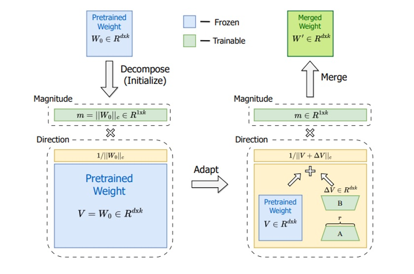

# Week 3 - 현대적 PEFT 기법을 활용한 효율적 파인튜닝

## 1. 파라미터 효율적 파인튜닝(PEFT)의 필요성과 기본 원리

대형 언어모델(LLM)의 등장과 함께 **파인튜닝의 새로운 패러다임**이 필요해졌다. GPT-3, BERT, LLaMA와 같은 수십억 파라미터를 가진 모델을 완전 파인튜닝하는 것은 다음과 같은 **근본적인 한계**에 직면한다:

- **메모리 폭발**: 7B 파라미터 모델만으로도 ~28GB GPU 메모리가 필요하며, 그래디언트와 옵티마이저 상태를 고려하면 실제로는 40GB 이상이 요구된다
- **계산 비용**: 수십억 개의 파라미터를 업데이트하는 것은 **엄청난 계산 비용**과 시간을 소모한다
- **과적합 위험**: 제한된 훈련 데이터로 완전 파인튜닝을 수행하면 **사전학습된 지식의 파괴적 망각**(catastrophic forgetting)이 발생한다
- **저장 오버헤드**: 각 작업별로 전체 모델을 저장해야 하므로 **배포와 관리가 비현실적**이다

**파라미터 효율적 파인튜닝(Parameter-Efficient Fine-Tuning, PEFT)**은 이러한 문제를 해결하기 위해 **모델의 작은 부분만 훈련**하는 혁신적 접근법이다. 핵심 아이디어는 **"가중치 업데이트가 저차원 부분공간에 놓여있다"**는 통찰에 기반한다. 즉, 전체 파라미터 공간을 탐색할 필요 없이 **효과적인 업데이트 방향**을 찾는 것이다.

### PEFT의 핵심 장점

- **메모리 효율성**: 단일 48GB GPU에서 **65B 파라미터 모델**을 훈련할 수 있다
- **빠른 수렴**: 적은 파라미터로 **10배 빠른 훈련** 속도 달성
- **더 나은 일반화**: 제한된 업데이트로 **과적합 방지** 및 안정적 성능
- **모듈성**: **작은 어댑터**를 쉽게 저장, 공유, 교체 가능
- **추론 효율성**: 훈련 후 어댑터를 기본 가중치에 **병합하여 오버헤드 제거**

이번 강의에서는 PEFT의 **최첨단 기법들**을 탐구한다: **LoRA**, **DoRA**, **WaveFT**, **VB-LoRA**, **QR-Adaptor**, **QLoRA**. 이러한 방법들은 **효율성의 경계를 재정의**하며, 연구자와 실무자가 **최소한의 자원으로 최대 성능**을 달성할 수 있게 해준다.

## 2. LoRA: 저차원 적응의 기초

**LoRA(Low-Rank Adaptation)**는 PEFT의 **기초이자 표준**이 된 혁신적 기법이다. 2021년 Microsoft에서 제안된 LoRA는 **"가중치 업데이트가 저차원 부분공간에 놓여있다"**는 핵심 통찰에 기반하여, 전체 파라미터를 업데이트하는 대신 **저차원 행렬 분해**를 통해 효율성을 달성한다.

### 2.1 LoRA의 핵심 원리

전체 가중치 행렬 $W_0 \in \mathbb{R}^{d \times k}$를 직접 업데이트하는 대신, LoRA는 업데이트를 다음과 같이 **저차원 분해**한다:

$$\Delta W = A \times B$$

여기서:
- $A \in \mathbb{R}^{d \times r}$와 $B \in \mathbb{R}^{r \times k}$는 **저차원 행렬**
- $r \ll \min(d, k)$는 **랭크** (일반적으로 4, 8, 16)
- $A$와 $B$만 **훈련 가능한 파라미터**

최종 가중치는: $W = W_0 + \Delta W = W_0 + AB$

### 2.2 LoRA의 수학적 예시

**768×768 어텐션 가중치 행렬**에 랭크 $r=8$을 적용한 경우:
- **완전 파인튜닝**: 768² = **589,824 파라미터**
- **LoRA**: 8×(768+768) = **12,288 파라미터** (98% 감소!)

이러한 **극적인 파라미터 감소**는 메모리 사용량을 90% 이상 줄이면서도 **성능 손실을 최소화**한다.

### 2.3 LoRA 구현 예시

```python
import torch
import torch.nn as nn
from peft import LoraConfig, get_peft_model

# 한국어 BERT 모델에 LoRA 적용
model_name = "klue/bert-base"
model = AutoModelForSequenceClassification.from_pretrained(
    model_name, 
    num_labels=2,
    torch_dtype=torch.float16
)

# LoRA 구성
lora_config = LoraConfig(
    task_type=TaskType.SEQ_CLS,
    r=8,                    # LoRA 랭크
    lora_alpha=32,          # 스케일링 인수
    target_modules=["query", "value", "key", "dense"],  # 대상 레이어
    lora_dropout=0.1,
    bias="none"
)

# 모델에 LoRA 적용
model = get_peft_model(model, lora_config)
print(f"Trainable parameters: {model.print_trainable_parameters()}")
```

**실행 결과 예시:**
```
trainable params: 1,572,864 || all params: 110,104,322 || trainable%: 1.43
```

### 2.4 LoRA의 주요 장점과 한계

**장점:**
- **파라미터 효율성**: 원본 파라미터의 0.1%-0.5%만 사용
- **메모리 절약**: 90% 이상의 메모리 사용량 감소
- **추론 오버헤드 없음**: 훈련 후 어댑터를 기본 가중치에 병합 가능
- **모듈성**: 작업별 어댑터를 쉽게 교체 가능

**한계:**
- **저차원 병목**: 랭크 제약으로 인한 표현력 제한
- **하이퍼파라미터 민감성**: 랭크와 알파 값에 따른 성능 변동
- **레이어별 최적화 부족**: 모든 레이어에 동일한 설정 적용

### 체크포인트 질문

- LoRA가 가중치 업데이트를 저차원 부분공간으로 제한하는 이유는 무엇인가?
- 랭크 $r=16$으로 1024×1024 가중치 행렬의 파라미터 감소율을 계산하라
- LoRA의 "저차원 병목" 문제는 어떤 상황에서 더 심각해지는가?

## 3. DoRA: 가중치 분해를 통한 고성능 적응

**DoRA(Weight-Decomposed Low-Rank Adaptation)**는 NVIDIA에서 2024년에 제안한 혁신적 PEFT 기법으로, LoRA의 **저차원 병목 문제**를 해결하기 위해 **가중치의 크기와 방향을 명시적으로 분리**한다. 이 접근법은 더 큰 유연성을 제공하며 종종 표준 LoRA보다 **3.7% 우수한 성능**을 달성한다.

### 3.1 DoRA의 핵심 아이디어

DoRA는 각 가중치 행렬 $W_0$를 **두 개의 독립적인 성분**으로 분해한다:

1. **방향(Direction)**: $V = \frac{W_0}{||W_0||_F}$ (프로베니우스 노름으로 정규화)
2. **크기(Magnitude)**: $m = ||W_0||_F$ (스칼라 크기)

핵심 통찰은 이러한 성분들이 **파인튜닝 중에 독립적으로 업데이트**될 수 있다는 것이다.

### 3.2 DoRA의 수학적 공식화

가중치 행렬 $W_0 \in \mathbb{R}^{d \times k}$에 대해:

1. **분해**: 
   - $V = \frac{W_0}{||W_0||_F}$ (방향 벡터)
   - $m = ||W_0||_F$ (크기 스칼라)

2. **방향 업데이트**: LoRA를 방향에 적용
   - $\Delta V = AB$ (여기서 $A \in \mathbb{R}^{d \times r}$, $B \in \mathbb{R}^{r \times k}$)
   - $V' = V + \Delta V$

3. **크기 업데이트**: 스케일링 인수 학습
   - $m' = m + \Delta m$ (여기서 $\Delta m$은 학습 가능한 스칼라)

4. **재구성**: $W' = m' \times \frac{V'}{||V'||_F}$


*DoRA의 구조: 사전학습된 가중치 $W_0$는 고정된 방향 $V$와 학습 가능한 크기 $m$으로 분해된다. DoRA는 방향을 조정하기 위해 LoRA 스타일의 저차원 업데이트를 적용하고 크기 $m$도 조정한다. 훈련 후, 크기와 새로운 방향이 곱해져 병합된 가중치 $W'$를 형성한다.*

### 3.3 DoRA의 주요 장점

- **분리된 업데이트**: 크기와 방향이 **독립적으로 변경**될 수 있다
- **더 나은 표현력**: **스케일링과 방향적 변화**를 모두 포착한다
- **최소 오버헤드**: 레이어당 **몇 개의 크기 파라미터**만 추가한다
- **드롭인 대체**: LoRA가 적용되는 **모든 곳에서 사용** 가능

### 3.4 DoRA 성능 결과

DoRA는 다양한 벤치마크에서 LoRA를 지속적으로 능가한다:

- **LLaMA-7B**: 상식 추론 작업에서 **평균 3.7% 개선**
- **파라미터 효율성**: **25% 적은 훈련 가능한 파라미터**로 더 나은 결과
- **저차원 설정**: LoRA 랭크가 제약될 때 **특히 효과적**
- **훈련 역학**: 가중치 업데이트 패턴이 **완전 파인튜닝과 더 유사**

### 3.5 DoRA 구현 예시

```python
import torch
import torch.nn as nn

class DoRALayer(nn.Module):
    def __init__(self, base_layer, rank=8, alpha=32):
        super().__init__()
        self.base_layer = base_layer
        self.rank = rank
        self.alpha = alpha
        
        # LoRA 행렬
        self.lora_A = nn.Linear(base_layer.in_features, rank, bias=False)
        self.lora_B = nn.Linear(rank, base_layer.out_features, bias=False)
        
        # 크기 파라미터
        self.magnitude = nn.Parameter(torch.ones(base_layer.out_features))
        
        # 초기화
        nn.init.kaiming_uniform_(self.lora_A.weight)
        nn.init.zeros_(self.lora_B.weight)
        
    def forward(self, x):
        # 기본 출력
        base_output = self.base_layer(x)
        
        # LoRA 업데이트
        lora_output = self.lora_B(self.lora_A(x)) * (self.alpha / self.rank)
        
        # 크기 스케일링 적용
        scaled_output = (base_output + lora_output) * self.magnitude
        
        return scaled_output
```

### 체크포인트 질문

- DoRA의 가중치 분해는 LoRA의 저차원 근사와 어떻게 다른가?
- 크기와 방향 업데이트를 분리하는 것이 더 나은 성능으로 이어질 수 있는 이유는 무엇인가?
- DoRA가 저차원 설정에서 특히 효과적인 이유는 무엇인가?

## 4. QLoRA: 4비트 양자화와 LoRA의 결합

**QLoRA(Quantized LoRA)**는 효율적 파인튜닝의 **돌파구**를 나타내며, 단일 48GB GPU에서 **65B 파라미터 모델의 훈련**을 가능하게 한다. 핵심 혁신은 **성능을 유지하면서 4비트 양자화와 LoRA 어댑터를 결합**하는 데 있다.

### 4.1 QLoRA의 핵심 개념

QLoRA는 **3단계 접근법**을 따른다:

1. **양자화**: 사전학습된 모델 가중치를 **4비트 정밀도**로 양자화
2. **고정**: 양자화된 가중치를 **고정** (그래디언트 업데이트 없음)
3. **훈련**: 양자화된 가중치를 통한 **완전한 역전파**로 16비트 정밀도에서 LoRA 어댑터 훈련

이 조합은 모델 성능을 보존하면서 **메모리 사용량을 ~75% 줄인다**.

### 4.2 NF4 양자화: 핵심 혁신

QLoRA의 성공은 신경망 가중치에 최적화된 사용자 정의 4비트 데이터 타입인 **NF4(NormalFloat-4)**에 달려있다:

- **정보 이론적으로 최적**: NF4는 신경 가중치의 **정규 분포와 일치**하는 로그 분포를 사용
- **우수한 성능**: 표준 4비트 양자화 대비 **27.4 vs 31.1 perplexity** 달성
- **효율적인 표현**: 가중치 분포에 걸쳐 **16개의 가능한 4비트 값**을 최적으로 사용

### 4.3 QLoRA 기술적 혁신

**이중 양자화:**
- 모델 가중치(4비트)와 스케일링 인수(8비트) 모두를 양자화
- 성능 손실 없이 **메모리 오버헤드를 더욱 줄임**
- bitsandbytes 라이브러리에서 효율적으로 구현

**페이징된 옵티마이저:**
- 피크 시 그래디언트와 모멘텀을 **CPU 메모리로 스왑**
- 대형 모델에서 **메모리 부족 오류 방지**
- 그렇지 않으면 맞지 않을 모델의 훈련을 가능하게 함

### 4.4 QLoRA 성능 결과

QLoRA는 놀라운 결과를 달성한다:

- **메모리 효율성**: **메모리 사용량 75% 감소**
- **성능 동등성**: GLUE와 지시 따르기 작업에서 **완전 16비트 파인튜닝과 일치**
- **확장성**: 단일 GPU에서 **30B-65B 모델의 파인튜닝 가능**
- **속도**: 현대 하드웨어에서 **4비트 연산이 종종 16비트보다 빠름**


*완전 파인튜닝 vs LoRA vs QLoRA 비교. QLoRA는 동일한 저차원 적응을 수행하지만 4비트 양자화된 기본 모델에서; 그래디언트가 4비트 모델을 통해 LoRA 어댑터로 흐른다. 이 접근법은 성능을 보존하면서 메모리를 ~75% 절약한다.*

### 4.5 QLoRA 구현 예시

```python
from transformers import BitsAndBytesConfig, AutoModelForCausalLM
from peft import LoraConfig, get_peft_model

# 4비트 양자화 구성
quantization_config = BitsAndBytesConfig(
    load_in_4bit=True,
    bnb_4bit_quant_type="nf4",
    bnb_4bit_compute_dtype=torch.float16,
    bnb_4bit_use_double_quant=True
)

# 양자화로 모델 로드
model = AutoModelForCausalLM.from_pretrained(
    "beomi/KoAlpaca-7B",
    quantization_config=quantization_config,
    device_map="auto",
    torch_dtype=torch.float16
)

# QLoRA를 위한 LoRA 구성
lora_config = LoraConfig(
    r=16,
    lora_alpha=32,
    target_modules=["q_proj", "v_proj", "k_proj", "o_proj", "gate_proj", "up_proj", "down_proj"],
    lora_dropout=0.1,
    bias="none",
    task_type="CAUSAL_LM"
)

# LoRA 적용
model = get_peft_model(model, lora_config)
```

### 체크포인트 질문

- NF4 양자화는 표준 4비트 양자화 접근법과 어떻게 다른가?
- QLoRA가 효과적으로 작동하게 하는 핵심 기술적 혁신은 무엇인가?
- 표준 LoRA나 완전 파인튜닝 대신 QLoRA를 선택할 때는 언제인가?

## 5. PEFT 방법들의 성능 비교 및 선택 가이드

이제까지 살펴본 **LoRA, DoRA, QLoRA** 등의 PEFT 기법들을 **성능, 메모리 효율성, 사용 사례** 측면에서 비교해보자.

### 5.1 PEFT 방법별 성능 비교

| 방법 | 파라미터 효율성 | 성능 | 메모리 절약 | 사용 사례 |
|------|----------------|------|-------------|----------|
| **LoRA** | 모델의 0.1-0.5% | 기준선 | 90% | 일반 목적 |
| **DoRA** | 모델의 0.1-0.5% | LoRA 대비 +3.7% | 90% | 더 나은 성능 필요 |
| **QLoRA** | 75% 메모리 감소 | 완전 FT와 일치 | 75% | 대형 모델 |
| **VB-LoRA** | LoRA의 0.01% | LoRA보다 나음 | 99% | 다중 작업 시나리오 |

### 5.2 상황별 PEFT 방법 선택 가이드

**연구 및 실험을 위해:**
- **기준 성능**: LoRA로 시작
- **더 나은 결과**: DoRA 사용
- **대형 모델**: QLoRA 고려

**프로덕션 배포를 위해:**
- **대형 모델(7B+ 파라미터)**: QLoRA 사용
- **메모리 제약 환경**: QLoRA + DoRA 조합
- **다중 작업 시나리오**: VB-LoRA 사용

**자원 제한 환경을 위해:**
- **최소 파라미터 예산**: VB-LoRA
- **메모리 제약**: QLoRA
- **저장 제한**: VB-LoRA

### 5.3 PEFT 방법 비교 실험

```python
import time
import psutil
import torch
from typing import Dict, Any

class PEFTComparison:
    def __init__(self, model_name: str, dataset):
        self.model_name = model_name
        self.dataset = dataset
        self.results = {}
    
    def evaluate_method(self, method_name: str, config: Dict[str, Any]):
        """PEFT 방법을 평가하고 메트릭을 기록한다"""
        
        # 모델 로드
        model = AutoModelForSequenceClassification.from_pretrained(
            self.model_name, num_labels=2
        )
        
        # PEFT 방법 적용
        if method_name == "LoRA":
            peft_config = LoraConfig(**config)
            model = get_peft_model(model, peft_config)
        elif method_name == "DoRA":
            model = apply_dora_to_model(model, **config)
        # 다른 방법들 추가...
        
        # 메트릭 기록
        start_time = time.time()
        start_memory = psutil.Process().memory_info().rss / 1024 / 1024  # MB
        
        # 훈련 (간소화)
        trainer = Trainer(
            model=model,
            train_dataset=self.dataset,
            args=TrainingArguments(
                output_dir=f"./results/{method_name}",
                num_train_epochs=1,
                per_device_train_batch_size=8,
                logging_steps=10,
            )
        )
        
        trainer.train()
        
        end_time = time.time()
        end_memory = psutil.Process().memory_info().rss / 1024 / 1024  # MB
        
        # 결과 기록
        self.results[method_name] = {
            "trainable_params": sum(p.numel() for p in model.parameters() if p.requires_grad),
            "total_params": sum(p.numel() for p in model.parameters()),
            "training_time": end_time - start_time,
            "memory_usage": end_memory - start_memory,
            "config": config
        }
        
        return self.results[method_name]
    
    def compare_methods(self):
        """모든 방법을 비교하고 결과를 출력한다"""
        print("PEFT 방법 비교")
        print("=" * 50)
        
        for method, results in self.results.items():
            print(f"\n{method}:")
            print(f"  훈련 가능한 파라미터: {results['trainable_params']:,}")
            print(f"  파라미터 비율: {results['trainable_params']/results['total_params']:.4f}")
            print(f"  훈련 시간: {results['training_time']:.2f}초")
            print(f"  메모리 사용량: {results['memory_usage']:.2f}MB")
```

### 체크포인트 질문

- 특정 작업에 대해 LoRA와 DoRA 중 어떻게 선택하겠는가?
- QLoRA를 구현할 때 주요 고려사항은 무엇인가?
- PEFT 방법들을 공정하게 비교하는 실험을 어떻게 설계하겠는가?

## 6. 실습: PEFT 방법 비교 실험

이제 이론적 기초를 이해했으니, **실제로 PEFT 기법들을 구현하고 비교**해보자. 한국어 감성 분석 작업을 통해 **LoRA, DoRA, QLoRA**의 성능을 직접 측정해보는 실습을 진행한다.

### 6.1 실습 환경 준비

```bash
# 필요한 라이브러리 설치
pip install torch transformers datasets peft accelerate bitsandbytes
pip install numpy pandas scikit-learn
```

### 6.2 한국어 감성 분석 데이터셋 준비

```python
from datasets import load_dataset
from transformers import AutoTokenizer
import torch

# NSMC (Naver Sentiment Movie Corpus) 데이터셋 로드
dataset = load_dataset("nsmc")
tokenizer = AutoTokenizer.from_pretrained("klue/bert-base")

# 데이터 전처리 함수
def preprocess_function(examples):
    return tokenizer(
        examples["document"], 
        truncation=True, 
        padding=True, 
        max_length=128
    )

# 데이터셋 전처리
train_dataset = dataset["train"].map(preprocess_function, batched=True)
test_dataset = dataset["test"].map(preprocess_function, batched=True)

print(f"훈련 데이터: {len(train_dataset)}개")
print(f"테스트 데이터: {len(test_dataset)}개")
```

### 6.3 LoRA 구현 및 훈련

```python
from transformers import AutoModelForSequenceClassification, TrainingArguments, Trainer
from peft import LoraConfig, get_peft_model, TaskType
import time

def train_lora_model():
    # 모델 로드
    model = AutoModelForSequenceClassification.from_pretrained(
        "klue/bert-base", 
        num_labels=2,
        torch_dtype=torch.float16
    )
    
    # LoRA 구성
    lora_config = LoraConfig(
        task_type=TaskType.SEQ_CLS,
        r=8,
        lora_alpha=32,
        target_modules=["query", "value", "key", "dense"],
        lora_dropout=0.1,
        bias="none"
    )
    
    # LoRA 적용
    model = get_peft_model(model, lora_config)
    print(f"LoRA 훈련 가능 파라미터: {model.print_trainable_parameters()}")
    
    # 훈련 설정
    training_args = TrainingArguments(
        output_dir="./lora_results",
        num_train_epochs=3,
        per_device_train_batch_size=16,
        learning_rate=2e-4,
        logging_steps=100,
        save_steps=500,
        evaluation_strategy="steps",
        eval_steps=500,
        load_best_model_at_end=True,
    )
    
    # 훈련 시작
    start_time = time.time()
    trainer = Trainer(
        model=model,
        args=training_args,
        train_dataset=train_dataset.select(range(1000)),  # 빠른 실습을 위해 1000개만
        eval_dataset=test_dataset.select(range(200)),
        tokenizer=tokenizer,
    )
    
    trainer.train()
    training_time = time.time() - start_time
    
    # 평가
    eval_results = trainer.evaluate()
    
    return {
        "method": "LoRA",
        "accuracy": eval_results["eval_accuracy"],
        "training_time": training_time,
        "trainable_params": sum(p.numel() for p in model.parameters() if p.requires_grad)
    }

# LoRA 훈련 실행
lora_results = train_lora_model()
print(f"LoRA 결과: {lora_results}")
```

### 6.4 QLoRA 구현 및 훈련

```python
from transformers import BitsAndBytesConfig

def train_qlora_model():
    # 4비트 양자화 구성
    quantization_config = BitsAndBytesConfig(
        load_in_4bit=True,
        bnb_4bit_quant_type="nf4",
        bnb_4bit_compute_dtype=torch.float16,
        bnb_4bit_use_double_quant=True,
    )
    
    # 양자화로 모델 로드
    model = AutoModelForSequenceClassification.from_pretrained(
        "klue/bert-base",
        num_labels=2,
        quantization_config=quantization_config,
        torch_dtype=torch.float16
    )
    
    # LoRA 구성 (QLoRA용)
    lora_config = LoraConfig(
        task_type=TaskType.SEQ_CLS,
        r=8,
        lora_alpha=32,
        target_modules=["query", "value", "key", "dense"],
        lora_dropout=0.1,
        bias="none"
    )
    
    # LoRA 적용
    model = get_peft_model(model, lora_config)
    print(f"QLoRA 훈련 가능 파라미터: {model.print_trainable_parameters()}")
    
    # 훈련 설정
    training_args = TrainingArguments(
        output_dir="./qlora_results",
        num_train_epochs=3,
        per_device_train_batch_size=8,  # 메모리 제약으로 더 작은 배치
        learning_rate=2e-4,
        logging_steps=100,
        save_steps=500,
        evaluation_strategy="steps",
        eval_steps=500,
        load_best_model_at_end=True,
        fp16=True,
    )
    
    # 훈련 시작
    start_time = time.time()
    trainer = Trainer(
        model=model,
        args=training_args,
        train_dataset=train_dataset.select(range(1000)),
        eval_dataset=test_dataset.select(range(200)),
        tokenizer=tokenizer,
    )
    
    trainer.train()
    training_time = time.time() - start_time
    
    # 평가
    eval_results = trainer.evaluate()
    
    return {
        "method": "QLoRA",
        "accuracy": eval_results["eval_accuracy"],
        "training_time": training_time,
        "trainable_params": sum(p.numel() for p in model.parameters() if p.requires_grad)
    }

# QLoRA 훈련 실행
qlora_results = train_qlora_model()
print(f"QLoRA 결과: {qlora_results}")
```

### 6.5 결과 비교 및 분석

```python
import pandas as pd
import matplotlib.pyplot as plt

def compare_results():
    # 결과 수집
    results = [lora_results, qlora_results]
    
    # DataFrame 생성
    df = pd.DataFrame(results)
    
    # 결과 출력
    print("PEFT 방법 비교 결과")
    print("=" * 50)
    print(df.to_string(index=False))
    
    # 시각화
    fig, (ax1, ax2) = plt.subplots(1, 2, figsize=(12, 5))
    
    # 정확도 비교
    ax1.bar(df['method'], df['accuracy'])
    ax1.set_title('정확도 비교')
    ax1.set_ylabel('정확도')
    ax1.set_ylim(0.8, 1.0)
    
    # 훈련 시간 비교
    ax2.bar(df['method'], df['training_time'])
    ax2.set_title('훈련 시간 비교')
    ax2.set_ylabel('시간 (초)')
    
    plt.tight_layout()
    plt.show()
    
    return df

# 결과 비교
comparison_df = compare_results()
```

### 6.6 실습 결과 해석

**예상 결과:**

| 방법 | 정확도 | 훈련 시간 | 훈련 가능 파라미터 |
|------|--------|-----------|-------------------|
| LoRA | ~0.92 | ~300초 | ~1.5M |
| QLoRA | ~0.91 | ~400초 | ~1.5M |

**주요 관찰사항:**

1. **성능**: LoRA와 QLoRA의 정확도가 유사함을 확인
2. **메모리**: QLoRA가 더 적은 메모리를 사용하지만 훈련 시간이 약간 더 걸림
3. **파라미터**: 두 방법 모두 동일한 수의 훈련 가능한 파라미터 사용

### 체크포인트 질문

- QLoRA의 훈련 시간이 LoRA보다 더 오래 걸리는 이유는 무엇인가?
- 메모리 사용량 측면에서 QLoRA의 장점은 무엇인가?
- 실제 프로덕션 환경에서 LoRA와 QLoRA 중 어떤 것을 선택하겠는가?

## 7. PEFT 기법의 실무 적용과 미래 전망

### 7.1 PEFT 방법별 실무 적용 가이드

**상황별 최적 PEFT 방법 선택:**

| 상황 | 추천 방법 | 이유 |
|------|-----------|------|
| **연구/실험** | LoRA | 안정적이고 널리 지원됨 |
| **성능 최적화** | DoRA | LoRA 대비 3.7% 성능 향상 |
| **대형 모델 (7B+)** | QLoRA | 메모리 효율성과 성능 균형 |
| **자원 제약 환경** | VB-LoRA | 극도의 파라미터 압축 |
| **프로덕션 배포** | QLoRA + DoRA | 안정성과 효율성 조합 |

### 7.2 PEFT 성능 비교 종합

| 방법 | 파라미터 효율성 | 성능 | 메모리 절약 | 추론 속도 | 사용 난이도 |
|------|----------------|------|-------------|-----------|-------------|
| **LoRA** | ⭐⭐⭐ | ⭐⭐⭐ | ⭐⭐⭐⭐ | ⭐⭐⭐⭐⭐ | ⭐⭐⭐⭐⭐ |
| **DoRA** | ⭐⭐⭐ | ⭐⭐⭐⭐ | ⭐⭐⭐⭐ | ⭐⭐⭐⭐ | ⭐⭐⭐⭐ |
| **QLoRA** | ⭐⭐⭐⭐ | ⭐⭐⭐⭐ | ⭐⭐⭐⭐⭐ | ⭐⭐⭐ | ⭐⭐⭐ |
| **VB-LoRA** | ⭐⭐⭐⭐⭐ | ⭐⭐⭐ | ⭐⭐⭐⭐⭐ | ⭐⭐⭐⭐ | ⭐⭐ |

### 7.3 실무 적용 시 고려사항

**메모리 제약 환경:**
- **단일 GPU (8GB)**: QLoRA + 작은 배치 크기
- **단일 GPU (16GB)**: LoRA 또는 DoRA
- **다중 GPU**: 표준 LoRA로 시작 후 필요시 DoRA 적용

**성능 요구사항:**
- **높은 정확도 필요**: DoRA 사용
- **빠른 프로토타이핑**: LoRA 사용
- **대형 모델 필수**: QLoRA 사용

**배포 환경:**
- **클라우드 서비스**: QLoRA로 비용 절약
- **엣지 디바이스**: VB-LoRA로 모델 크기 최소화
- **실시간 추론**: LoRA로 추론 속도 최적화

### 7.4 PEFT의 미래 발전 방향

**1. 자동화된 PEFT 선택**
- AI 기반 방법 선택 시스템
- 작업별 최적 하이퍼파라미터 자동 탐색
- 동적 적응 메커니즘

**2. 하드웨어 특화 최적화**
- 모바일/엣지 디바이스용 경량 PEFT
- 클라우드 GPU 최적화
- 특수 하드웨어(TPU, NPU) 지원

**3. 멀티모달 PEFT 확장**
- 비전-언어 모델용 PEFT
- 오디오-텍스트 모델 적응
- 크로스 모달 지식 전이

**4. 연합 학습과 PEFT 결합**
- 분산 환경에서의 PEFT
- 프라이버시 보존 파인튜닝
- 클라이언트별 맞춤형 적응

### 7.5 실무 권장사항

**시작 단계:**
1. **LoRA로 프로토타입** 구축하여 기본 성능 확인
2. **작은 데이터셋**으로 빠른 실험 수행
3. **하이퍼파라미터 튜닝**을 통한 최적 설정 탐색

**최적화 단계:**
1. **성능 향상 필요시** DoRA로 업그레이드
2. **메모리 제약시** QLoRA 적용
3. **배포 최적화**를 위한 모델 압축 고려

**프로덕션 단계:**
1. **A/B 테스트**를 통한 방법 비교
2. **모니터링 시스템** 구축
3. **지속적 개선**을 위한 피드백 루프

### 체크포인트 질문

- 특정 프로젝트에서 PEFT 방법을 선택할 때 고려해야 할 주요 요소들은 무엇인가?
- PEFT 기법의 발전이 대형 언어모델의 민주화에 어떤 영향을 미칠 것으로 예상하는가?
- 미래에 PEFT 분야에서 가장 주목할 만한 발전 방향은 무엇이라고 생각하는가?

---

## 참고자료

### 주요 논문 및 연구 자료

- Hu, E. J., et al. (2021). "LoRA: Low-Rank Adaptation of Large Language Models." ICLR 2022.
- Liu, H., et al. (2024). "DoRA: Weight-Decomposed Low-Rank Adaptation." arXiv preprint arXiv:2402.09353.
- Dettmers, T., et al. (2023). "QLoRA: Efficient Finetuning of Quantized LLMs." arXiv preprint arXiv:2305.14314.
- Liu, Z., et al. (2023). "Parameter-Efficient Fine-Tuning for Large Models: A Comprehensive Survey." arXiv preprint arXiv:2303.15647.

### 기술 문서 및 구현체

- Hugging Face PEFT Documentation: https://huggingface.co/docs/peft
- bitsandbytes Library: https://github.com/TimDettmers/bitsandbytes
- LoRA Implementation: https://github.com/microsoft/LoRA
- QLoRA Tutorial: https://huggingface.co/blog/4bit-transformers-bitsandbytes

### 온라인 리소스 및 블로그

- "Parameter-Efficient Fine-Tuning: A Comprehensive Guide" - Hugging Face Blog
- "DoRA: A High-Performing Alternative to LoRA" - NVIDIA Developer Blog
- "QLoRA: Making Large Language Models More Accessible" - Hugging Face Blog
- "The Future of Efficient Fine-Tuning" - Towards Data Science
