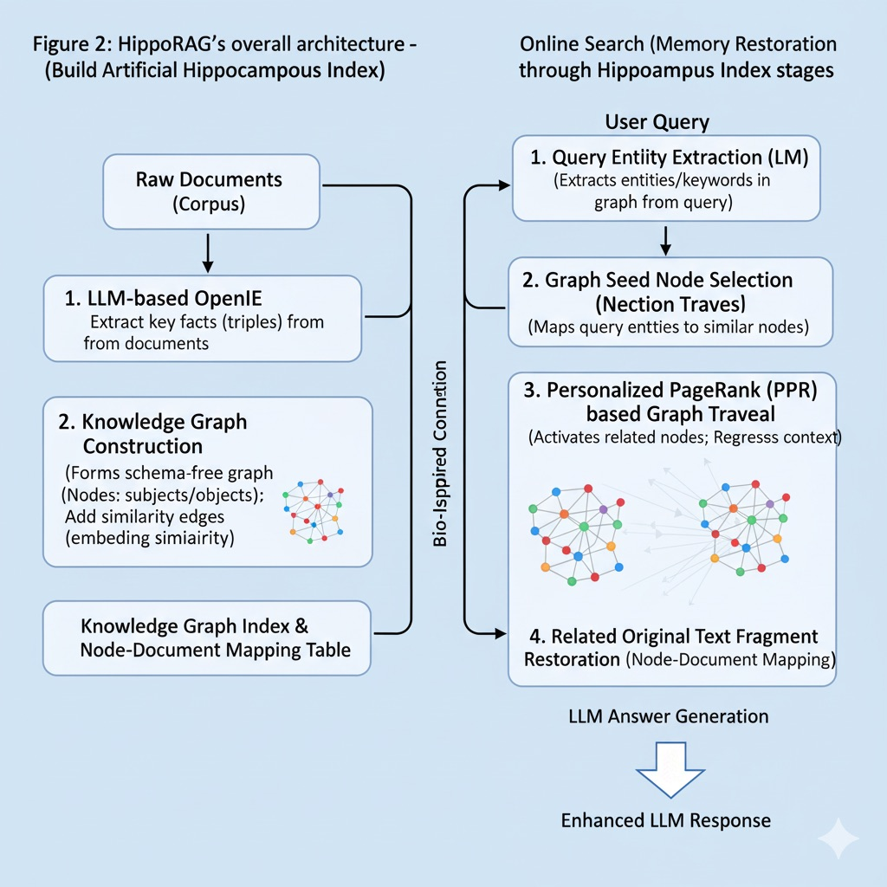
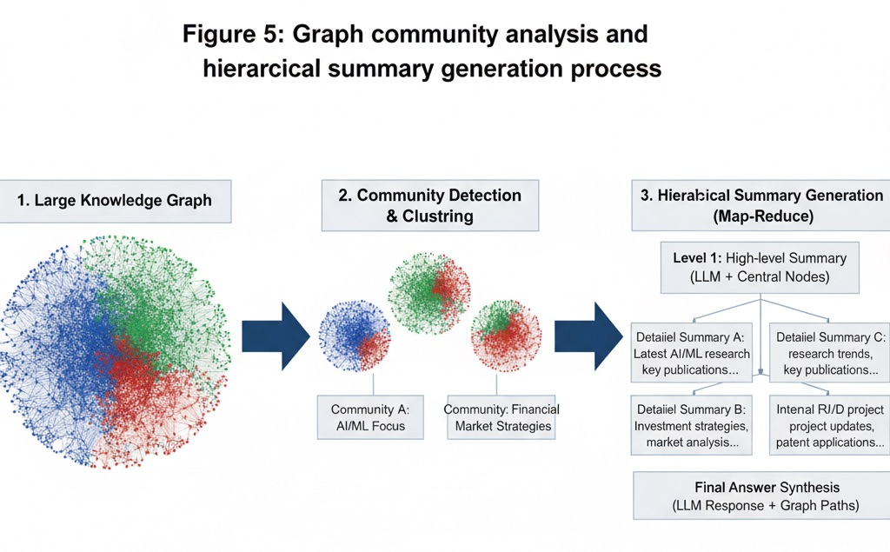
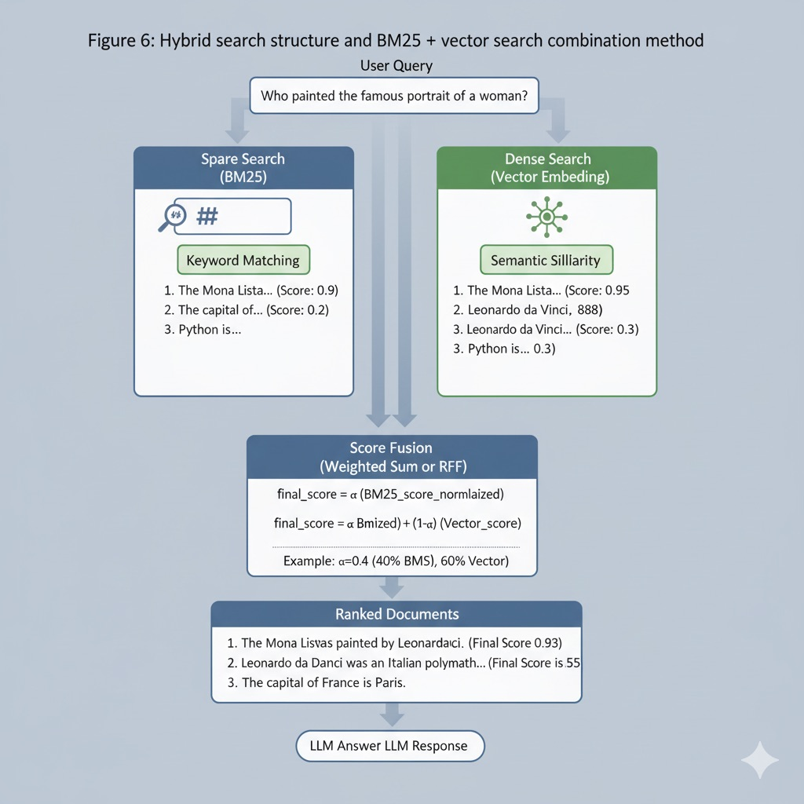
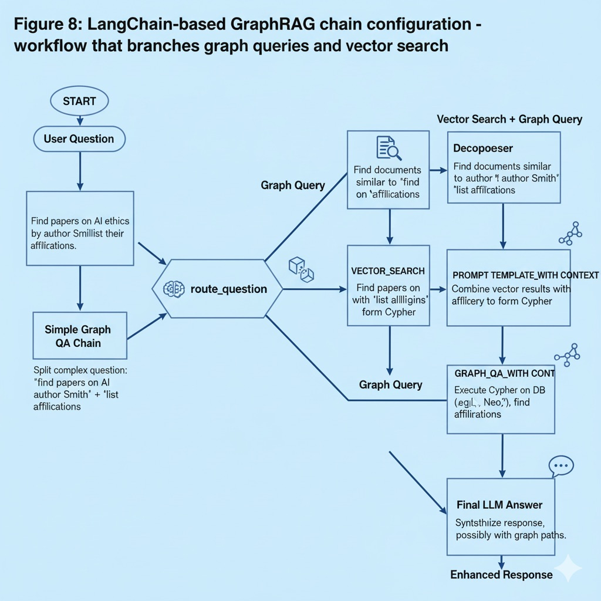

# Week 9: 고급 RAG 아키텍처

이번 주차에서는 **Retrieval-Augmented Generation**(RAG) 기법의 고급 아키텍처를 다룬다. 이전까지 학습한 **벡터 RAG** 방식은 문서를 벡터로 임베딩하고 쿼리에 유사한 벡터를 검색하여 LLM에 전달하는 구조였다. 이는 긴 문맥 한계를 극복하고 **외부 지식베이스**를 활용하는 강력한 방법이지만, 여전히 **다중 문서 간 지식 통합**이나 **연결 관계 추론** 등에서는 한계를 보인다. 이번 강의에서는 이러한 한계를 극복하기 위해 등장한 **차세대 RAG 아키텍처**들을 살펴보고, 이들의 **구조적 특징**과 **실용적 구현** 방법을 학습한다. 특히 **HippoRAG**, **GraphRAG**, **하이브리드 검색** 기법에 집중하며, 앞서 배운 **LangChain** 활용법 및 **벡터 DB**, **FlashAttention**, **PEFT** 등의 개념과 자연스럽게 연결지어 설명한다.

## 1. RAG 진화의 필요성: 장기 기억과 다중 문맥 통합

기존 RAG 시스템(벡터 기반)은 사용자의 질문을 받아 관련 문서를 **임베딩 유사도**로 검색하고, 찾아온 몇 개의 문서를 LLM에 컨텍스트로 주어 답변을 생성하는 구조였다. 이런 **벡터 RAG** 접근은 LLM이 사전에 학습하지 않은 **외부 지식**을 동적으로 활용할 수 있게 해 주었지만, 다음과 같은 한계가 드러났다:

- **다중-홉 추론의 어려움**: 답변에 필요한 정보가 **여러 문서에 분산**된 경우, 벡터 검색만으로 관련 조각들을 모두 찾기 어렵다. 기존 해결책으로 **Iterative RAG** (예: IRCoT 등)로 여러 번 질의-생성을 반복하는 방법이 사용되었으나, 비효율적이고 여전히 누락이 발생한다.

- **연관 관계 맥락 부족**: 벡터 임베딩은 의미 유사성은 잘 포착하지만, 문서들 간의 **명시적 관계** (예: A가 B의 부분, 원인-결과 관계 등)를 표현하지 못한다. 따라서 **지식 그래프**처럼 관계를 표현하거나, 키워드 기반 정확 매칭이 필요한 경우 대응이 어렵다.

- **장기 메모리 관리 부재**: 현재까지 RAG는 새 문서를 추가하면 **기존 벡터 DB에 무한 축적**하는 방식이어서, 시간이 지남에 따라 **불필요한 정보 누적**이나 **노이즈 증가** 문제가 있다. 인간의 기억처럼 오래된 정보를 잊거나 통합 정리(consolidation)하는 기능이 부족했다.

이러한 이유로, RAG를 **인간 두뇌의 장기 기억 체계**에 좀더 가깝게 발전시키려는 시도가 이루어졌다. 즉, **구조화된 인덱스** (예: 지식 그래프), **의도적 망각** (오래된 정보 제거), **지식 통합** (요약 및 관계 추출) 등의 기능을 갖춘 **진화된 RAG** 아키텍처가 등장하고 있다. 이번 섹션들에서 다룰 HippoRAG, GraphRAG, 하이브리드 검색 등은 이러한 맥락에서 개발된 기법들이다. 또한 이러한 고급 RAG 구조는 **FlashAttention**과 같은 효율적 Transformer 기법(긴 문맥 처리)이나 **PEFT** 기반 미세조정(지식 주입)과 상호보완적으로 작용할 수 있다 – 예를 들어, **RAG**로 외부 지식을 가져오면서 **FlashAttention**으로 긴 컨텍스트를 효율 처리하거나, **PEFT**로 LLM을 미세조정하여 RAG 통합 지식을 더 잘 활용하도록 하는 식이다.

### 체크포인트 질문

- 왜 기본 벡터 RAG 시스템만으로는 **여러 문서에 걸친 지식 통합** (멀티-홉 질의)에 한계가 있을까? 그 한계를 보완하기 위해 어떤 접근이 시도되어 왔나?

- 인간 두뇌의 장기 기억 기능과 비교할 때, 기존 RAG 구조에는 어떤 **메모리 관리 기능**이 부족한가? (예: 망각, 통합 등)

- FlashAttention이나 PEFT와 같은 기법들은 RAG와 어떻게 조합될 수 있을까? 이러한 조합을 통해 얻을 수 있는 **이점**은 무엇인가?

## 2. HippoRAG: 생물학적 장기 기억 모방 아키텍처

**HippoRAG**는 **인간 해마** (hippocampus)의 기억 형성 이론에서 영감을 받아 고안된 고급 RAG 프레임워크다. 이 접근법은 **NeurIPS 2024**에서 발표되었으며, **해마-대뇌피질 간 상호작용**을 모방하여 LLM의 장기 지식통합 능력을 향상시키는 것이 핵심이다. HippoRAG의 작동을 이해하기 위해 우선 영감이 된 **해마 기반 기억 인덱싱 이론**을 간략히 살펴보자:


_그림 1: 인간 해마의 기억 형성 이론과 HippoRAG 아키텍처의 대응 관계_

- **대뇌피질** (Neocortex): 감각경험을 추상화하여 **고차원 표현**으로 저장하는 역할 – 인간 뇌에서는 실제 기억 내용이 여러 피질 영역에 분산 저장된다.

- **해마** (Hippocampus): **기억의 인덱스** 역할 – 개별 경험을 고유한 패턴으로 분리(**pattern separation**), 일부 단서로 전체 기억을 복원(**pattern completion**)하는 역할을 한다. 해마는 새로운 경험이 들어오면 자신만의 인덱스를 갱신하고, 기존 대뇌피질 기억을 덮어쓰지 않음으로써 **연속학습(continuously learning)**이 가능하게 해 준다.

- **Para-hippocampal region** (PHR): 대뇌피질과 해마를 연결하는 중계 – 유사한 개념들을 연결하여 해마로 보낼 때 **유사성 링크**를 형성해 준다.

이 이론을 RAG에 적용한 것이 HippoRAG이다. HippoRAG는 **오프라인 인덱싱 단계**와 **온라인 검색 단계**의 두 단계로 동작한다:


_그림 2: HippoRAG의 전체 아키텍처 - 오프라인 인덱싱과 온라인 검색 단계_

**(1) 오프라인 인덱싱 – 인공 해마 인덱스 구축:** 원문 문서들을 **지식 그래프** (knowledge graph) 형태로 변환하여, 일종의 **“해마 인덱스”**를 미리 만들어 두는 과정이다. 구체적인 절차는 다음과 같다:

- **LLM 기반 OpenIE**: 대용량 LLM(예: GPT-4 등)을 활용하여 각 문서에서 **주요 사실** (triple)을 추출한다. 예컨대 문장 "Thomas 교수는 Stanford에서 Alzheimer 연구를 한다"에서 (Thomas, researches, Alzheimer’s), (Stanford, employs, Thomas) 같은 삼원소(triple)를 추출한다. 이는 인간 대뇌피질이 경험을 처리하여 요소로 분해하는 과정에 대응된다. 이러한 **Open Information Extraction**을 통해 문서 내용을 **밀집 벡터**가 아닌 **구조화된 정보 조각**으로 저장함으로써, 각 사실들이 서로 섞이지 않고 **구분 저장(pattern separation)**된다.

- **지식 그래프 구성**: 추출된 모든 triple들의 **주어/객체**를 노드로, **관계**를 엣지로 하여 **스키마 없는 지식 그래프**를 형성한다. 이 그래프는 모든 문서의 지식을 통합한 **연결망 형태의 인덱스**가 된다.

- **시놉시스 링크 추가** (PHR 역할): PHR에 해당하는 부분으로, **동의어나 유사 개념**을 연결하는 추가 엣지를 부여한다. 이를 위해 각 노드(개념)에 대해 **임베딩 유사도**를 계산하고, 코사인 유사도가 임계치 이상인 노드 쌍 사이에 **유의어 엣지**를 추가한다. 예컨대 "Alzheimer’s"와 "Alzheimer’s disease" 노드 간에 연결을 형성하여, 검색 시 한쪽을 보면 다른 쪽도 활성화되도록 만든다. 이는 해마로 전달되기 전 PHR이 유사 기억들을 연계해주는 기능과 유사하다.

- **노드-문서 맵핑 저장**: 그래프의 각 노드(개념)가 어떤 원문 단락에 등장했는지 기록한 매핑표를 저장한다. 이는 이후 검색 결과를 다시 실제 원문 문단으로 환원하기 위한 정보다.

이렇게 구축된 **지식 그래프 인덱스**는 인간 뇌의 해마가 구축한 **연합 기억망**에 해당한다. 이 인덱스는 전통적인 벡터 DB보다 **메모리 효율적**일 수 있는데, 벡터로 전체 문서를 저장하는 대신 **핵심 개념 노드들만 저장**하므로 저장 공간을 크게 절약한다 (연구에 따르면 약 **25%** 저장 공간 절감 효과 보고). 또한 개념 간 관계가 명시적으로 연결되어 있으므로, **연결 중심의 추론**에 강점을 보인다.


_그림 3: 문서에서 지식 그래프 인덱스 구축 과정_

**(2) 온라인 검색 – 해마 인덱스를 통한 기억 복원:** 사용자의 질의가 들어오면, HippoRAG는 **부분 단서만으로 전체 기억을 복원**하는 과정을 모방하여 관련 정보를 찾아낸다. 단계는 다음과 같다:

- **질의 개체 추출** (Neocortex 역할): LLM을 한 번 호출하여 사용자 질문에 등장하는 **중요 개체명**이나 **키워드**를 뽑아낸다. 예를 들어 질문이 "Alzheimer 연구를 하는 Stanford 교수는 누구인가?"라면, 추출 결과 **{Stanford, Alzheimer’s}** 같은 집합이 나온다.

- **그래프 시드 노드 선택**: 추출된 질의 개체들을 각각 **임베딩**하여, 그래프 내에서 가장 유사한 노드들을 찾는다. 위 예시에서 **Stanford**와 **Alzheimer’s** 노드에 가장 가까운 노드는 아마도 **Thomas Südhof**일 것이다. 이렇게 선택된 노드들이 해마 검색의 **출발 지점** (partial cue) 역할을 한다.

- **Personalized PageRank (PPR) 기반 그래프 탐색**: HippoRAG의 핵심 단계이다. 선택된 시드 노드들로부터 그래프 위에서 **개인화 페이지랭크** 알고리즘을 수행한다. PPR은 시드 노드에서 출발하여 인접한 노드로 확률적 “확산”을 하는데, 시드 근처의 노드에 높은 확률이 몰리게 조율된다. 이는 해마가 부분 단서로 관련 기억 전체를 활성화(Pattern Completion)하는 것에 대응된다. PPR 결과로 그래프 내 연관된 노드들이 **가중치**를 부여받는데, 이는 해당 개념이 **현재 질의와 얼마나 관련 깊은지**를 나타낸다.

- **관련 원문 조각 복원**: PPR로 얻은 상위 노드들을, **노드-문서 맵핑표**를 사용해 다시 원문 단락으로 매핑한다. 각 단락마다 그 안에 등장한 노드들의 PPR 점수를 합산하여 **최종 순위**를 결정한다. 이렇게 가장 관련성 높은 문단 몇 개를 최종 LLM에 전달하여 답변을 생성한다.

HippoRAG는 이러한 과정을 통해 **한 번의 검색으로 다중-홉 정보 연결**을 이뤄낸다. 예를 들어 앞의 Stanford/Alzheimer’s 예시에서, 기존 벡터 RAG라면 **"Stanford"**로 한 번 검색하고 결과를 바탕으로 다시 **"Thomas Südhof"** 정보를 찾는 **두 단계 검색**이 필요했겠지만, HippoRAG는 **그래프**를 통해 **한 번에** “Stanford→Thomas Südhof←Alzheimer’s” 연결을 찾아낸다. 실험 결과에 따르면, HippoRAG는 **2단계 이상 지식 통합이 필요한 QA에서 기존 SOTA 대비 최대 20%** 높은 정확도를 보였고, **IRCoT** 같은 반복 검색 기법 대비 **10~20배** 저렴하고 **6~13배** 빠른 성능을 달성했다.

비유하자면, **벡터 RAG**가 각 문서를 섬으로 보고 질문과 비슷한 섬을 몇 개 고르는 방식이라면, **HippoRAG**는 문서들을 잇는 다리를 미리 놓아두고 질문의 단서를 지닌 섬에서 시작해 **다리를 따라 이동**함으로써 목적지 정보를 찾아오는 셈이다. 이러한 **Neuro-symbolic** 결합 덕분에, HippoRAG는 인간처럼 부분 정보로부터 연관된 전체 맥락을 재구성하는 능력을 LLM에 부여한다.

### 체크포인트 질문

- HippoRAG의 오프라인 인덱싱 단계에서 **벡터 임베딩** 대신 **지식 그래프**를 구축하는 이유는 무엇인가? 이를 통해 얻는 이점은 무엇일까?

- HippoRAG에서 **Personalized PageRank** (PPR) 알고리즘은 어떤 역할을 하며, 이를 통해 다중 문서 추론이 어떻게 향상되는가?

- HippoRAG와 기존 벡터 RAG 또는 IRCoT와 비교했을 때, **응답 정확도**나 **속도 측면**에서 어떠한 개선이 보고되었는가?

## 3. GraphRAG: 지식 그래프 기반 Retrieval-Augmented Generation

**GraphRAG**는 마이크로소프트 등에서 제안한 **그래프 강화 RAG** 아키텍처로, **지식 그래프**를 활용하여 대규모 문서의 **주제별 연관성**을 체계적으로 활용하는 접근이다. 개념적으로 앞서 살펴본 HippoRAG와 유사하게 **문서 간 관계**를 명시적으로 모델링하지만, 구현과 응용 면에서 차이가 있다. GraphRAG의 목표는 **비구조화 텍스트를 구조화된 지식 형태로 변환**하여 **질의응답의 정확성**과 **해석 가능성**을 높이는 것이다.


_그림 4: GraphRAG의 전체 파이프라인 구조_

GraphRAG의 전형적인 **워크플로우**는 다음과 같이 요약된다:

1. **문서 → 텍스트 청크 분할**: 대용량 문서를 일정 길이로 분할한다. (너무 긴 청크는 정보 손실을 유발하고, 너무 짧으면 검색 부정확성과 비용 문제가 생기므로 적절한 **청크 크기**를 선정해야 한다.)

2. **엔티티 및 관계 추출**: 각 청크를 LLM을 이용해 처리하여 **주요 엔티티** (명사구), **관계** (동사/전치사 구), **사실** (claim, 수치) 등을 추출한다. LLM이 추출한 각 요소에는 간략한 설명을 붙여 **해석 가능성**을 높인다. (예: "NeoChip"이라는 회사 엔티티 추출 시 "저전력 프로세서를 전문으로 하는 공개 기업" 등의 설명을 함께 생성.)

3. **지식 그래프 구성**: 추출된 엔티티들을 노드로, 관계를 엣지로 하여 **가중치가 부여된 지식 그래프**를 만든다. 만약 동일한 관계가 여러 문서에서 등장하면 해당 엣지 가중치를 높여 **중복 중요도**를 표시한다. 또한 중복된 엔티티나 사실은 **클러스터링 및 요약**하여 그래프를 간결하게 만든다.

4. **그래프 커뮤니티 분석**: 완성된 그래프에 대해 **커뮤니티 탐지 알고리즘** (예: Leiden 알고리즘)을 적용하여, 노드들이 촘촘히 연결된 **토픽 클러스터**들을 식별한다. 이러한 **계층적 클러스터링**을 통해 거대 지식 그래프를 **주제별 하위 그래프**들로 나누어 다룰 수 있고, 이는 이후 **요약** 및 **검색 범위 축소**에 유용하다.

5. **커뮤니티별 요약 생성**: 찾아낸 각 커뮤니티(주제)에 대해 그 내용을 대표하는 요약을 생성한다. 이때 해당 토픽에서 **중심 노드** (연결도가 높은 중요 엔티티)들을 우선 포함하도록 하여 **의미 밀도**를 최대화한다. 그래프 계층이 여러 단계인 경우, 상위 계층은 하위 요약들을 포함하는 식으로 **재귀적 요약**을 수행하여, **다중 해상도**의 주제 요약 정보를 얻는다.

6. **계층적 질의 응답**: 사용자의 질문이 들어오면, 우선 질문에 맞는 **커뮤니티 요약**을 선별하여 (필요하면 여러 주제의 요약 혼합), 이를 LLM에 투입해 **1차 응답들** (Map 단계)을 생성한다. 그런 다음 각 응답의 **유용성 점수**를 평가하고, 상위 응답들을 다시 모아 **최종 답변** (Reduce 단계)을 생성한다. 이러한 **맵-리듀스** 방식은 거대한 문서군에 대해서도 계층적으로 답변을 구성함으로써, **전반적인 정확성과 일관성**을 높여준다.

위 GraphRAG 파이프라인을 통해, 단순 임베딩 기반 검색 대비 **설명 가능하고 주제 구조화된 검색**이 가능해진다. 예를 들어 대기업 내부 보고서 수천 개를 GraphRAG로 처리하면, **분야별 지식 그래프 + 요약**이 생성되어, 사용자가 "최근 3년간 AI 연구 성과 요약" 같은 질문을 하면 해당 커뮤니티 요약들을 이용해 빠르고 정확한 답변을 생성할 수 있다. 또한 답변 근거로 그래프 경로나 요약을 제시함으로써 **신뢰성**을 높일 수 있다.


_그림 5: 그래프 커뮤니티 분석과 계층적 요약 생성 과정_

마이크로소프트가 발표한 GraphRAG 사례에서는, **위키백과 소설 "Christmas Carol"**을 GraphRAG 파이프라인으로 구조화하여 **질의응답**을 수행하는 예시를 보였다. 이를 통해 전통적인 RAG보다 **높은 응답 정확도** (최대 99% 정밀도)를 시현하고, 복잡한 대규모 데이터셋에서도 **이해 가능한 추론 과정** (knowledge graph 경로, 요약 내용)을 사용자에게 제공할 수 있음을 보였다.

GraphRAG는 개념상 HippoRAG와 유사하지만, 구현에서는 **오픈소스 툴** (예: Microsoft의 **GraphRAG 라이브러리**)을 통해 **Knowledge Graph + 벡터 DB 결합** 형태로 제공되기도 한다. 또한 GraphRAG는 **데이터 엔지니어링 측면** (그래프 생성, 커뮤니티 분석 등)의 작업이 많아 **사전 구축 비용**이 크지만, 일단 구축된 그래프를 활용하면 **질의응답 단계의 비용은 절감**되는 장점이 있다.

### 체크포인트 질문

- GraphRAG 파이프라인에서 **지식 그래프**와 **커뮤니티 탐지**를 도입하는 목적은 무엇인가? 이러한 구조화가 질의응답에 어떻게 기여하는지 설명해보자.

- GraphRAG의 **맵-리듀스 질의응답 전략**은 무엇이며, 왜 이런 접근이 대규모 문서 집합에 효과적일까?

- HippoRAG와 GraphRAG는 모두 그래프를 사용하지만, **구현 방법**이나 **적용 범위** 면에서 어떤 차이가 있을까? 예를 들어 실시간 동적 업데이트 측면에서 두 기법을 비교해보자.

## 4. 하이브리드 검색: 키워드와 임베딩의 조합

**하이브리드 검색**은 전통 **희소** (Lexical) 검색과 **밀집** (Vector) 검색을 결합하여 두 방법의 장점을 모두 활용하는 접근이다. 앞서 다룬 HippoRAG나 GraphRAG가 **지식 구조화**에 초점을 맞췄다면, 하이브리드 검색은 **검색 알고리즘 수준**에서의 개선으로, **정확한 키워드 매칭 능력**과 **의미적 유사도 추론 능력**을 동시에 활용한다.


_그림 6: 하이브리드 검색의 구조와 BM25 + 벡터 검색 결합 방식_

전통적으로 **BM25**와 같은 **키워드 기반 랭킹**은 질의와 문서 사이의 **정확한 용어 일치**에 강하며, 오타나 약어, 이름 등을 정확히 찾아줄 수 있다. 그러나 의미가 같아도 표현이 다르면 놓치기 쉽고, 문맥적 의미를 반영하지 못하는 단점이 있다. 반대로 **임베딩 기반 벡터 검색**은 문장의 **의미적 유사성**을 잘 포착하여 표현이 달라도 관련있는 결과를 찾지만, 정확한 키워드(예: 코드 스니펫, 고유명사 등)는 지나칠 수 있다.

하이브리드 검색은 **이 두 가지를 병렬로 수행**한 후 결과를 **통합** (score fusion)하는 방식이다. 예를 들어 OpenAI Embedding + BM25 조합의 하이브리드 검색에서는, 하나의 질의에 대해 **BM25 스코어**와 **코사인 유사도 스코어**를 각각 구한 뒤 **가중 합산 또는 Rank-Fusion** 기법으로 최종 순위를 매긴다. 단순 가중합의 경우:

```
final_score = α * (BM25_score_normalized) + (1-α) * (Vector_score)
```

형태로 조정할 수 있다. (α는 두 검색의 중요도 비율) 또는 **Reciprocal Rank Fusion (RRF)**처럼, 각각의 결과 목록에서의 **등수**에 기반하여 점수를 합산하는 기법도 널리 쓰인다. RRF는 각 검색 방법의 스코어 분포 차이에 영향받지 않으면서 두 결과를 섞을 수 있어 자주 사용된다.

**LangChain**에서는 이러한 하이브리드 검색을 쉽게 구현하도록 EnsembleRetriever 등을 제공한다. 다음은 LangChain을 활용해 **BM25 + 벡터 임베딩** 하이브리드 검색기를 구성하는 예시 코드다:

```python
from langchain.retrievers import BM25Retriever, EnsembleRetriever
from langchain.embeddings.openai import OpenAIEmbeddings
from langchain.vectorstores import FAISS
from langchain.schema import Document

# 1. 문서 리스트 (예시 문장들)
texts = [
    "The capital of France is Paris.",
    "Machine learning enables computers to learn from data.",
    "The Mona Lisa was painted by Leonardo da Vinci.",
    "Python is a popular programming language for AI."
]
documents = [Document(page_content=text) for text in texts]

# 2. BM25 기반 Retriever 생성
bm25_retriever = BM25Retriever.from_documents(documents)
bm25_retriever.k = 2  # 상위 2개 결과 사용

# 3. 벡터 기반 Retriever 생성 (OpenAI 임베딩 + FAISS)
embeddings = OpenAIEmbeddings()  # 임베딩 모델 (예: text-embedding-ada-002)
vector_store = FAISS.from_documents(documents, embeddings)
vector_retriever = vector_store.as_retriever(search_kwargs={"k": 2})

# 4. Ensemble (하이브리드) Retriever 생성 (BM25 40%, 벡터 60% 가중치)
hybrid_retriever = EnsembleRetriever(
    retrievers=[bm25_retriever, vector_retriever],
    weights=[0.4, 0.6]
)

# 5. 예시 질의 실행
query = "Who painted the famous portrait of a woman?"
results = hybrid_retriever.get_relevant_documents(query)
for idx, doc in enumerate(results, start=1):
    print(f"Result {idx}: {doc.page_content}")
```

**실행 결과:**

```
Result 1: The Mona Lisa was painted by Leonardo da Vinci.
Result 2: The capital of France is Paris.
```

위 결과에서 볼 수 있듯, 질의 "유명한 여성 초상화를 그린 사람은?"에 대해 하이브리드 검색은 **Mona Lisa 관련 문장**을 1순위로 찾아낸다. 순수 벡터 검색만 했다면 "Mona Lisa"라는 정확 단어가 없으면 놓칠 수 있고, BM25만 했다면 "초상화" 등의 키워드 매칭에 의존하여 부정확할 수 있다. 하이브리드 방식은 **키워드 일치** (Mona Lisa→portrait 매칭)와 **의미 유사** (famous woman portrait→Mona Lisa 그림 의미 연결) 양쪽을 다 반영하므로 최적의 결과를 얻는다.


_그림 7: 벡터 검색, BM25 검색, 하이브리드 검색의 결과 비교_

하이브리드 검색은 특히 **전문 용어나 코드, 고유명사**가 중요한 도메인에서 유용하다. 예컨대 의료 문서에서 **약어** ("BP" vs "Blood Pressure")처럼 벡터로는 잡기 어려운 항목이나, 소스 코드 질의처럼 **문자 그대로 일치해야 의미 있는 경우**에 BM25가 보완적 역할을 한다. 실제 사례로 Stack Overflow는 기존 TF-IDF 기반 검색을 버리고 **임베딩 + 키워드** 하이브리드로 전환하여, 코드 포함 질문에서 키워드 매칭을 놓치지 않으면서도 의미적 관련 답변을 찾아내 **검색 품질을 크게 향상**시켰다.

물론 하이브리드 검색에도 **고려사항**이 있다. 두 가지 검색을 병렬 수행하므로 **레이턴시** (latency)가 증가할 수 있고, 점수 결합/정규화에 따른 **튜닝 작업**이 필요하다. 하지만 대부분 벡터 DB들이 기본적으로 하이브리드 기능(예: Elastic, Pinecone, Weaviate 등)이나 API 지원을 제공하고 있어 구현 난이도는 낮아지고 있다.

정리하면, 하이브리드 검색은 **"정확히 물어보는 것"**과 **"의도를 이해해서 찾아주는 것"** 사이의 균형을 잡아준다. 이는 RAG 시스템의 **Retriever** 단계 성능을 극대화하여, LLM에게 **더 좋은 컨텍스트**를 공급함으로써 최종 답변의 품질을 높이는 효과가 있다.

### 체크포인트 질문

- 하이브리드 검색에서 **BM25와 임베딩 검색**은 각각 어떤 타입의 정보를 잘 찾아주는가? 두 방식을 결합하면 시너지 효과가 나는 이유는 무엇인가?

- 하이브리드 검색 구현 시, 서로 다른 검색 스코어를 결합해야 한다. **정규화**나 **Rank Fusion** 기법은 이러한 결합 문제를 어떻게 해결해 주는가?

- 본인이 RAG 시스템을 구축한다면, 어떠한 상황에서 순수 벡터 검색보다 하이브리드 검색을 채택하는 것이 유리할지 사례를 들어 설명해보자.

## 5. LangChain을 활용한 GraphRAG 구현 실습

앞서 소개한 고급 RAG 기법들은 구현 난이도가 높아 보일 수 있지만, 다행히도 **LangChain**과 같은 프레임워크를 활용하면 일부 기능을 비교적 손쉽게 실습해볼 수 있다. 특히 **GraphRAG**의 경우, LangChain에는 **그래프 질의 체인**과 **그래프 상태 머신**을 지원하는 모듈들이 존재한다. 이번 섹션에서는 LangChain으로 **간단한 GraphRAG** 워크플로우를 구현하는 방법을 소개한다.

먼저, LangChain의 **GraphQAChain**을 사용한 기본적인 그래프 질의응답 예제이다. 이 체인은 **그래프 데이터베이스**와 LLM을 연결하여, 그래프 상의 쿼리를 수행하고 결과를 LLM이 자연어로 답변하게 해 준다.

```python
from langchain_experimental.graph_transformers import LLMGraphTransformer
from langchain.chains import GraphQAChain
from langchain_community.graphs.networkx_graph import NetworkxEntityGraph
from langchain_openai import OpenAI

# 1. 예시 텍스트와 LLM 준비
text = "Marie Curie was a physicist. Marie Curie won a Nobel Prize. Marie Curie worked in Paris."
llm = OpenAI(model_name='gpt-3.5-turbo', temperature=0)  # OpenAI LLM 예시

# 2. LLM Graph Transformer로 텍스트를 그래프 triple로 변환
documents = [text]
graph_transformer = LLMGraphTransformer(llm=llm)
graph_docs = graph_transformer.convert_to_graph_documents(documents)

# 3. NetworkX 그래프 객체 생성 및 노드/엣지 추가
graph = NetworkxEntityGraph()
for node in graph_docs.nodes:
    graph.add_node(node.id)
for edge in graph_docs.relationships:
    graph._graph.add_edge(edge.source.id, edge.target.id, relation=edge.type)

# 4. GraphQAChain 생성 (그래프와 LLM을 연결)
graph_qa_chain = GraphQAChain.from_llm(llm=llm, graph=graph, verbose=True)

# 5. 질의 실행
query = "What did Marie Curie win?"
result = graph_qa_chain.run(query)
print(result)
```

위 코드에서는 한 문단에 대한 간단한 **지식 그래프**를 LLM으로부터 추출하고(convert_to_graph_documents), 이를 NetworkX 그래프로 변환한 후, **GraphQAChain**을 통해 질의응답을 한다. 예시 질의 "Marie Curie가 무엇을 수상했는가?"에 대한 실행 결과는 다음과 같을 수 있다:

```
Marie Curie won a Nobel Prize.
```

LangChain의 GraphQAChain은 내부적으로 **질의 분석 → Cypher(그래프 질의어) 생성 → 그래프 DB 조회 → 결과 종합 → LLM 답변**의 단계를 거친다. 덕분에 사용자는 복잡한 Cypher 문법이나 그래프 탐색 로직을 직접 짤 필요 없이, **자연어 질의만으로** 그래프 정보를 활용한 답변을 얻을 수 있다. 이는 GraphRAG의 **온라인 검색 단계**를 LangChain이 추상화해준 예라고 볼 수 있다.

또한 LangChain에는 **그래프+벡터 혼합체인** 구성도 가능하다. 예컨대 **GraphCypherQAChain**은 **벡터 임베딩**을 사용해 질의를 그래프 쿼리로 변환하고, **Neo4j** 등 그래프DB에서 Cypher를 실행한 뒤, **추가적인 임베딩 검색과 결합**하는 **하이브리드 체인**이다. 복잡한 예지만, Microsoft의 LangGraph 확장을 이용하면 아래와 같이 **분기 있는 워크플로우**를 구축할 수 있다:


_그림 8: LangChain 기반 GraphRAG 체인 구성 - 그래프 질의와 벡터 검색을 분기 처리하는 워크플로우_

위 그림은 Neo4j에서 공개한 GraphRAG 예제 워크플로우를 단순화하여 표현한 것이다. **START** 노드에서 질문이 들어오면, **route_question** 함수가 질문 내용을 분석해 **벡터 검색이 필요하면 오른쪽 분기**로, **단순 그래프 질의면 왼쪽 분기**로 분기시킨다. 오른쪽 분기에서는 먼저 **Decomposer**가 복잡한 질문을 두 부분으로 쪼갠다 (예: "논문을 찾아라" + "그 논문의 저자를 구하라"). 그런 다음 **VECTOR_SEARCH** 노드에서 첫 번째 부분을 처리해 유사한 문서들을 찾고, 그 결과를 **PROMPT_TEMPLATE_WITH_CONTEXT** 노드에서 두 번째 그래프 질의 부분과 합쳐 Cypher 쿼리를 생성한다. 마지막으로 **GRAPH_QA_WITH_CONTEXT** 노드가 그래프 DB에서 답을 찾아 LLM으로 최종 응답을 준다. 왼쪽 분기는 전통적인 GraphQA 과정을 수행한다.

이러한 LangChain 기반 구현을 통해 얻을 수 있는 교훈은, **고급 RAG 아키텍처들도 충분히 모듈화하여 구성할 수 있다**는 점이다. 즉, **Retriever**를 다단계로 구성하거나 **Chain**을 분기/병합하여, HippoRAG나 GraphRAG에서 인간이 설계한 논리를 그대로 재현 가능하다. 예컨대 HippoRAG를 LangChain으로 구현하려면, 문서 임베딩 대신 **LLM triple 추출 + 그래프 빌드** 단계와, 질의 시 **NER + PPR 그래프 traversal** 단계를 Python 함수로 만들어서 Chain에 결합하면 된다. 실제로 HippoRAG의 공개 코드 또한 이러한 절차를 Python으로 구현하고 있다.

정리하면, **LangChain**은 고급 RAG 아이디어들을 손쉽게 실습해볼 수 있는 **훌륭한 도구**다. 이를 활용하면 학습자가 직접 **고급 RAG 파이프라인**을 만들어 보고, 각 단계가 결과에 미치는 영향을 관찰하며 심층 이해를 얻을 수 있다. 나아가 엔터프라이즈 환경에서 **자신만의 RAG 시스템**을 구축할 때도 LangChain의 모듈들을 활용하여 **프로토타입**을 빠르게 만들어볼 수 있을 것이다.

### 체크포인트 질문

- LangChain의 **GraphQAChain**은 어떤 방식으로 자연어 질문을 그래프 질의로 변환하고 답을 생성하는가? 내부 동작을 단계별로 추론해보자.

- 위 예시 워크플로우에서, **질문 분기** (route) 로직은 어떤 기준으로 그래프 vs 벡터 경로를 선택할까? 예를 들어 어떤 질문이 들어오면 벡터 검색이 필요한지 결정하는 요소는 무엇일까?

- 자신이 가진 도메인 데이터에 HippoRAG/GraphRAG를 적용한다고 가정해보자. LangChain으로 이를 구현하려면 어떤 모듈(체인, retriever, etc)을 활용해야 할지 구상해보자. (예: 연구 논문 데이터에 GraphRAG 적용 시)

## 6. 고급 RAG 적용 사례와 마무리

마지막으로, 실제 **대규모 시스템에서의 RAG 아키텍처 사례**를 간략히 살펴보며 정리한다. 최근 산업계에서는 하루 **수천만 토큰**의 질의를 처리하면서도 응답 지연을 100ms 이내로 유지해야 하는 등, **초대형 스케일의 RAG** 시스템이 운영되고 있다. 이를 위해 앞서 다룬 기술들이 종합적으로 활용된다. 예를 들어:

- **대용량 벡터 DB + Hybrid Search**: 수억 개 문서를 **벡터 임베딩**으로 저장하되, 첫 단계 후보 검색에 **BM25** 등 키워드 필터를 적용해 **검색 공간을 축소**하고, 임베딩 유사도 검색 + RRF로 정밀 순위를 매기는 구조를 사용한다. 이를 통해 **검색 정확도**와 **지연 시간**을 모두 잡는다.

- **FlashAttention 기반 장문 컨텍스트 처리**: 검색된 문서 조각을 LLM에 넣어 답변할 때, 한 번 프롬프트에 수만 토큰을 투입하기도 한다. 이런 경우 FlashAttention 같은 메모리 최적화 기법을 적용한 LLM 서버를 사용해, **대용량 컨텍스트**에서도 안정적으로 동작하도록 한다.

- **지속 학습과 망각**: 신규 문서가 매일 추가되는 상황에서 HippoRAG 방식을 응용하여, **새 문서들의 triple을 주기적으로 추출**해 지식 그래프 인덱스를 업데이트하고, 오래된 정보는 그래프에서 제거하거나 중요도가 낮아진 엣지는 가중치를 낮추는 **메모리 관리 정책**을 적용한다. 이를 통해 **업데이트 효율**과 **검색 품질**을 함께 유지한다.

앞서 살펴본 **HippoRAG**, **GraphRAG**, **Hybrid Search** 등의 기법은 이러한 대규모 시스템의 핵심 요소로서, 각각 **장기 메모리**, **연결 추론**, **검색 정밀도**를 담당한다. 학습자들은 이들 아키텍처를 이론적으로 이해하는 것을 넘어서, 실습과 프로젝트를 통해 **직접 구현하고 튜닝**해 봄으로써 심도 있는 통찰을 얻을 수 있을 것이다.

| 측면                | HippoRAG                                       | GraphRAG                                           | 하이브리드 검색                            |
| ------------------- | ---------------------------------------------- | -------------------------------------------------- | ------------------------------------------ |
| **핵심 접근법**     | 해마 이론 기반 생물학적 기억 인덱싱            | 커뮤니티 탐지와 함께하는 지식 그래프 구축          | 희소(BM25) 및 밀집(벡터) 검색의 결합       |
| **데이터 구조**     | 시놉시스 링크가 있는 지식 그래프 (PHR 연결)    | 커뮤니티 클러스터가 있는 계층적 지식 그래프        | 벡터 임베딩 + 역인덱스                     |
| **인덱싱 방법**     | LLM 기반 OpenIE → 그래프 구축 → 시놉시스 연결  | 엔티티/관계 추출 → 그래프 빌딩 → 커뮤니티 분석     | 문서 임베딩 + 키워드 인덱싱                |
| **검색 전략**       | 질의 엔티티 추출 → PPR 그래프 탐색 → 기억 복원 | 커뮤니티 요약 선택 → 맵-리듀스 답변 생성           | 병렬 BM25 + 벡터 검색 → 점수 융합          |
| **메모리 관리**     | 패턴 분리 및 완성 (해마와 유사)                | 계층적 요약 및 클러스터링                          | 주기적 업데이트가 있는 정적 인덱스         |
| **다중-홉 추론**    | ✅ 우수 (단일 단계 PPR 탐색)                   | ✅ 양호 (커뮤니티 기반 추론)                       | ❌ 제한적 (다중 질의 필요)                 |
| **정확 매칭 능력**  | ⚠️ 보통 (엔티티 추출에 의존)                   | ⚠️ 보통 (그래프 구조에 의존)                       | ✅ 우수 (BM25 구성요소)                    |
| **의미적 이해**     | ✅ 양호 (시놉시스 링크와 PPR을 통해)           | ✅ 우수 (LLM 기반 추출 및 요약)                    | ✅ 양호 (벡터 구성요소)                    |
| **저장 효율성**     | ✅ 높음 (25% 절감 보고됨)                      | ❌ 낮음 (광범위한 그래프 저장 필요)                | ⚠️ 보통 (이중 인덱싱 오버헤드)             |
| **질의 속도**       | ✅ 빠름 (반복 방법 대비 6-13배 빠름)           | ⚠️ 보통 (그래프 크기에 의존)                       | ⚠️ 보통 (병렬 검색 오버헤드)               |
| **구축 복잡도**     | ⚠️ 보통 (그래프 구축 필요)                     | ❌ 높음 (커뮤니티 탐지가 포함된 복잡한 파이프라인) | ✅ 낮음 (직관적인 구현)                    |
| **실시간 업데이트** | ⚠️ 보통 (그래프 업데이트 필요)                 | ❌ 어려움 (비용이 많이 드는 재클러스터링)          | ✅ 쉬움 (독립적인 인덱스 업데이트)         |
| **해석 가능성**     | ✅ 양호 (그래프 경로와 노드 활성화)            | ✅ 우수 (커뮤니티 요약과 그래프 증거)              | ⚠️ 제한적 (점수 결합만)                    |
| **최적 사용 사례**  | 다중 문서 추론, 장기 기억 시스템, 학술 연구    | 대규모 문서 분석, 기업 지식베이스, 주제 발견       | 기술 문서, 코드 검색, 혼합 콘텐츠 유형     |
| **일반적 도메인**   | 과학 문헌, 법률 문서, 연구 논문                | 기업 보고서, 위키피디아 규모 콘텐츠, 뉴스 아카이브 | Stack Overflow, 의료 기록, 소프트웨어 문서 |
| **LLM 통합**        | 답변 생성을 위한 직접적 컨텍스트 복원          | 커뮤니티 요약을 통한 계층적 프롬프팅               | 표준 RAG 파이프라인을 위한 향상된 검색     |
| **확장성**          | ✅ 양호 (효율적인 그래프 연산)                 | ⚠️ 보통 (커뮤니티 탐지 병목)                       | ✅ 양호 (병렬 처리)                        |
| **정확도 개선**     | 다중-홉 QA에서 20% 높음                        | 최대 99% 정밀도 보고됨                             | 단일 방법 접근법 대비 상당한 개선          |

이번 주차를 마치면 여러분은 **최신 RAG 아키텍처의 구성요소와 동작 원리**를 학습한 것이며, 이는 곧 다가올 **LangChain 기반 RAG 실습**의 밑바탕이 된다. 예를 들어 다음 단계에서는 실제 **사내 위키 문서**에 대해 GraphRAG를 구축하고, 검색 성능을 **벤치마킹 및 개선**하는 과제를 수행할 것이다. 그런 실습을 통해 본 강의에서 배운 개념들이 어떻게 현실 시스템에 적용되는지 체험해 보기 바란다.

### 체크포인트 질문

- 대규모 엔터프라이즈 RAG 시스템에서 **응답 지연**과 **검색 정확도**를 동시에 만족시키기 위해 어떤 기법들이 조합되어 사용되는가? 구체적인 사례를 들어보자.

- 지속적으로 업데이트되는 지식베이스에 RAG를 적용할 때, HippoRAG의 아이디어를 어떻게 활용할 수 있을까? (예: 새로운 정보 통합, 오래된 정보 처리 등)

- 이번 강의에서 배운 고급 RAG 개념들을 활용하여, 자신만의 RAG 파이프라인을 설계해본다면 어떤 구조를 구상하겠는가? 주요 단계와 사용할 기법들을 나열해보자.

## 참고자료

1. Chen, J., Lin, H., Han, X., & Sun, L. (2024). HippoRAG: Neurobiologically Inspired Long-Term Memory for Large Language Models. arXiv preprint arXiv:2405.14831.

2. Microsoft Research (2024). GraphRAG: Transforming Unstructured Text into Explainable, Queryable Intelligence using Knowledge Graph-Enhanced RAG.

3. Sharma, T. (2024). HippoRAG: Redefining AI Retrieval emulating the Hippocampus. Medium.

4. Sharma, T. (2024). Microsoft GraphRAG: Transforming Unstructured Text into Explainable, Queryable Intelligence using Knowledge Graph-Enhanced RAG. Medium.

5. Superlinked (2024). Optimizing RAG with Hybrid Search & Reranking. VectorHub.

6. Neo4j (2024). Create a Neo4j GraphRAG Workflow Using LangChain and LangGraph. Neo4j Developer Blog.

7. Nixie Search (2024). Search Overview Documentation. GitHub.

8. S, Suruthi (2024). Exploring HippoRAG: Neurobiologically Inspired Long-Term Memory for Large Language Models. Medium.

9. Shrsv (2024). About HippoRAG. DEV Community.

10. VectorHub (2024). Hybrid Search & Rerank RAG Documentation. GitHub.
